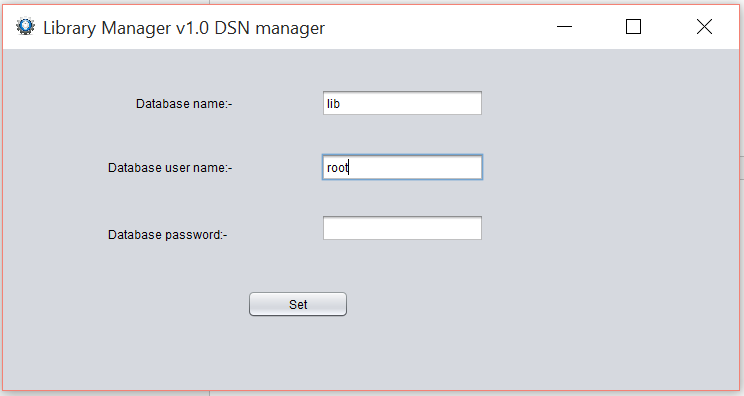
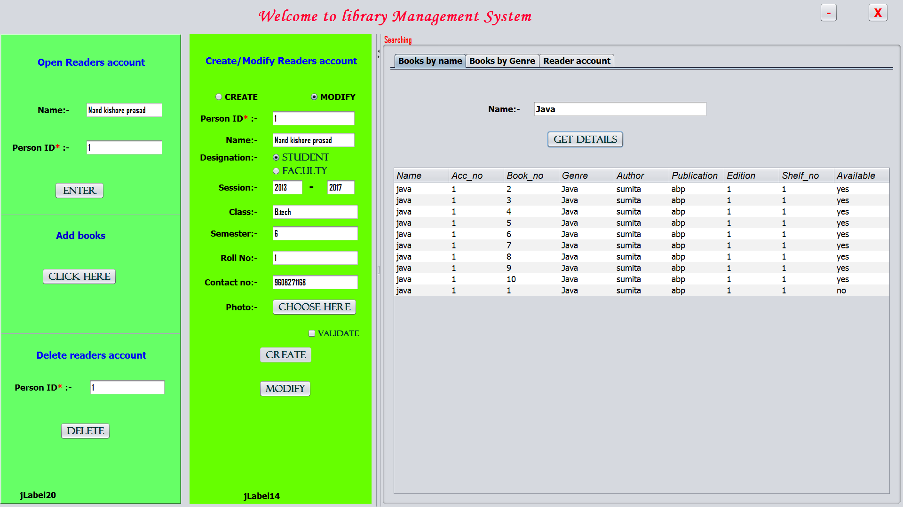

**Library Management System **

**software interface**

-   **Splash Screen**

-   **Login Screen**

-   **DSN setup Screen**

-   **Main interface Screen**

-   **Readers account**

    

-   **Add books**

    

***Coding:***

**Package apppack**

**1. pic.jpg**

**2. spl.java**

package apppack;

public class spl extends javax.swing.JFrame {

public spl() {

initComponents();

}

@SuppressWarnings("unchecked")

// &lt;editor-fold defaultstate="collapsed" desc="Generated Code"&gt;

private void initComponents() {

setDefaultCloseOperation(javax.swing.WindowConstants.EXIT\_ON\_CLOSE);

javax.swing.GroupLayout layout = new
javax.swing.GroupLayout(getContentPane());

getContentPane().setLayout(layout);

layout.setHorizontalGroup(

layout.createParallelGroup(javax.swing.GroupLayout.Alignment.LEADING)

.addGap(0, 595, Short.MAX\_VALUE)

);

layout.setVerticalGroup(

layout.createParallelGroup(javax.swing.GroupLayout.Alignment.LEADING)

.addGap(0, 407, Short.MAX\_VALUE)

);

pack();

setLocationRelativeTo(null);

}// &lt;/editor-fold&gt;

public static void main(String args\[\]) {

//&lt;editor-fold defaultstate="collapsed" desc=" Look and feel setting
code (optional) "&gt;

try {

for (javax.swing.UIManager.LookAndFeelInfo info :
javax.swing.UIManager.getInstalledLookAndFeels()) {

if ("Windows".equals(info.getName())) {

javax.swing.UIManager.setLookAndFeel(info.getClassName());

break;

}

}

} catch (ClassNotFoundException ex) {

java.util.logging.Logger.getLogger(spl.class.getName()).log(java.util.logging.Level.SEVERE,
null, ex);

} catch (InstantiationException ex) {

java.util.logging.Logger.getLogger(spl.class.getName()).log(java.util.logging.Level.SEVERE,
null, ex);

} catch (IllegalAccessException ex) {

java.util.logging.Logger.getLogger(spl.class.getName()).log(java.util.logging.Level.SEVERE,
null, ex);

} catch (javax.swing.UnsupportedLookAndFeelException ex) {

java.util.logging.Logger.getLogger(spl.class.getName()).log(java.util.logging.Level.SEVERE,
null, ex);

}

//&lt;/editor-fold&gt;

java.awt.EventQueue.invokeLater (new Runnable() {

public void run() {

new spl().setVisible(true);

}

});

}

}

**Package librarymanagement**

**1. Jdbc.java**

package librarymanagement;

import java.sql.\*;

import javax.swing.ImageIcon;

import javax.swing.JOptionPane;

public class Jdbc extends javax.swing.JFrame {

ImageIcon frameicon = new ImageIcon("lib\\\\Setting-icon.png");

Connection con;

PreparedStatement stat;

Statement stmt;

ResultSet rs;

static String
dbusername="root",dbpassword="",dbsourcename="lib?max\_allowed\_packet=&lt;10485760&gt;";

void connect()

{

try{

Class.forName("com.mysql.jdbc.Driver");

con=DriverManager.getConnection("jdbc:mysql://localhost:3306/"+dbsourcename,dbusername,dbpassword);

stmt=con.createStatement();

}

catch(Exception e){

JOptionPane.showMessageDialog(null,"Error : "+e,"Database connectivity
error",JOptionPane.ERROR\_MESSAGE);

}

}

}

**2. login.java**

package librarymanagement;

import java.awt.event.KeyEvent;

import javax.swing.JOptionPane;

public class login extends Jdbc {

public login() {

initComponents();

this.setResizable(false);

}

@SuppressWarnings("unchecked")

// &lt;editor-fold defaultstate="collapsed" desc="Generated Code"&gt;

private void initComponents() {

jLabel1 = new javax.swing.JLabel();

jLabel2 = new javax.swing.JLabel();

jTextField1 = new javax.swing.JTextField();

jLabel3 = new javax.swing.JLabel();

jPasswordField1 = new javax.swing.JPasswordField();

jButton1 = new javax.swing.JButton();

jLabel4 = new javax.swing.JLabel();

jCheckBox1 = new javax.swing.JCheckBox();

hint = new javax.swing.JLabel();

jButton2 = new javax.swing.JButton();

setDefaultCloseOperation(javax.swing.WindowConstants.EXIT\_ON\_CLOSE);

setTitle("Library Manager v1.0");

setBackground(new java.awt.Color(255, 255, 0));

setForeground(new java.awt.Color(255, 255, 0));

setIconImage(frameicon.getImage());

jLabel1.setFont(new java.awt.Font("Malgun Gothic Semilight", 1, 24)); //
NOI18N

jLabel1.setForeground(new java.awt.Color(51, 51, 255));

jLabel1.setText("Login Page");

jLabel2.setFont(new java.awt.Font("Tahoma", 1, 18)); // NOI18N

jLabel2.setText("User Name:-");

jTextField1.setFont(new java.awt.Font("Tahoma", 1, 18)); // NOI18N

jLabel3.setFont(new java.awt.Font("Tahoma", 1, 18)); // NOI18N

jLabel3.setText("Password:-");

jPasswordField1.setFont(new java.awt.Font("Tahoma", 1, 18)); // NOI18N

jButton1.setFont(new java.awt.Font("Microsoft JhengHei UI", 1, 24)); //
NOI18N

jButton1.setForeground(new java.awt.Color(0, 0, 102));

jButton1.setText("Login");

jButton1.addActionListener(new java.awt.event.ActionListener() {

public void actionPerformed(java.awt.event.ActionEvent evt) {

jButton1ActionPerformed(evt);

}

});

jButton1.addKeyListener(new java.awt.event.KeyAdapter() {

public void keyPressed(java.awt.event.KeyEvent evt) {

jButton1KeyPressed(evt);

}

});

jLabel4.setBackground(new java.awt.Color(255, 0, 51));

jLabel4.setFont(new java.awt.Font("Monotype Corsiva", 1, 36)); // NOI18N

jLabel4.setForeground(new java.awt.Color(255, 0, 51));

jLabel4.setText("Welcome to library Management System");

jCheckBox1.setText("Password Hint");

jCheckBox1.addActionListener(new java.awt.event.ActionListener() {

public void actionPerformed(java.awt.event.ActionEvent evt) {

jCheckBox1ActionPerformed(evt);

}

});

jButton2.setText("Set DSN");

jButton2.addActionListener(new java.awt.event.ActionListener() {

public void actionPerformed(java.awt.event.ActionEvent evt) {

jButton2ActionPerformed(evt);

}

});

javax.swing.GroupLayout layout = new
javax.swing.GroupLayout(getContentPane());

getContentPane().setLayout(layout);

layout.setHorizontalGroup(

layout.createParallelGroup(javax.swing.GroupLayout.Alignment.LEADING)

.addGroup(layout.createSequentialGroup()

.addGroup(layout.createParallelGroup(javax.swing.GroupLayout.Alignment.LEADING)

.addGroup(layout.createSequentialGroup()

.addGroup(layout.createParallelGroup(javax.swing.GroupLayout.Alignment.LEADING)

.addGroup(layout.createSequentialGroup()

.addGap(143, 143, 143)

.addComponent(jLabel2))

.addGroup(layout.createSequentialGroup()

.addGap(151, 151, 151)

.addComponent(jLabel3)))

.addGap(282, 282, 282)

.addGroup(layout.createParallelGroup(javax.swing.GroupLayout.Alignment.LEADING,
false)

.addComponent(jPasswordField1, javax.swing.GroupLayout.DEFAULT\_SIZE,
165, Short.MAX\_VALUE)

.addComponent(jTextField1)))

.addGroup(layout.createSequentialGroup()

.addGap(183, 183, 183)

.addComponent(jLabel4, javax.swing.GroupLayout.PREFERRED\_SIZE, 595,
javax.swing.GroupLayout.PREFERRED\_SIZE))

.addGroup(layout.createSequentialGroup()

.addGap(197, 197, 197)

.addComponent(jCheckBox1))

.addGroup(layout.createSequentialGroup()

.addGap(391, 391, 391)

.addComponent(hint))

.addGroup(layout.createSequentialGroup()

.addGap(396, 396, 396)

.addGroup(layout.createParallelGroup(javax.swing.GroupLayout.Alignment.LEADING)

.addComponent(jButton1, javax.swing.GroupLayout.PREFERRED\_SIZE, 103,
javax.swing.GroupLayout.PREFERRED\_SIZE)

.addGroup(layout.createSequentialGroup()

.addComponent(jLabel1)

.addPreferredGap(javax.swing.LayoutStyle.ComponentPlacement.RELATED,
156, Short.MAX\_VALUE)

.addComponent(jButton2, javax.swing.GroupLayout.PREFERRED\_SIZE, 175,
javax.swing.GroupLayout.PREFERRED\_SIZE)))))

.addGap(89, 89, 89))

);

layout.setVerticalGroup(

layout.createParallelGroup(javax.swing.GroupLayout.Alignment.LEADING)

.addGroup(layout.createSequentialGroup()

.addGap(23, 23, 23)

.addComponent(jLabel4)

.addGroup(layout.createParallelGroup(javax.swing.GroupLayout.Alignment.LEADING)

.addGroup(layout.createSequentialGroup()

.addGap(31, 31, 31)

.addComponent(jButton2))

.addGroup(layout.createSequentialGroup()

.addGap(58, 58, 58)

.addComponent(jLabel1, javax.swing.GroupLayout.PREFERRED\_SIZE, 45,
javax.swing.GroupLayout.PREFERRED\_SIZE)))

.addPreferredGap(javax.swing.LayoutStyle.ComponentPlacement.RELATED, 32,
Short.MAX\_VALUE)

.addGroup(layout.createParallelGroup(javax.swing.GroupLayout.Alignment.BASELINE)

.addComponent(jLabel2)

.addComponent(jTextField1, javax.swing.GroupLayout.PREFERRED\_SIZE,
javax.swing.GroupLayout.DEFAULT\_SIZE,
javax.swing.GroupLayout.PREFERRED\_SIZE))

.addGap(60, 60, 60)

.addGroup(layout.createParallelGroup(javax.swing.GroupLayout.Alignment.BASELINE)

.addComponent(jLabel3)

.addComponent(jPasswordField1, javax.swing.GroupLayout.PREFERRED\_SIZE,
javax.swing.GroupLayout.DEFAULT\_SIZE,
javax.swing.GroupLayout.PREFERRED\_SIZE))

.addGap(27, 27, 27)

.addComponent(jButton1)

.addGap(15, 15, 15)

.addComponent(hint)

.addGap(18, 18, 18)

.addComponent(jCheckBox1)

.addGap(30, 30, 30))

);

pack();

setLocationRelativeTo(null);

}// &lt;/editor-fold&gt;

String uname,pass,dbhint,dbuname,dbpass;

library\_manage ob=null;

private void jButton1ActionPerformed(java.awt.event.ActionEvent evt) {

uname=jTextField1.getText().toLowerCase();

pass=new String(jPasswordField1.getPassword());

connect();

try{

stmt = con.createStatement();

String sql;

sql = "SELECT uname,password,hint FROM login";

rs = stmt.executeQuery(sql);

while(rs.next())

{

dbuname = rs.getString("uname");

dbpass = rs.getString("password");

if(jCheckBox1.isSelected()&&uname.equals(dbuname))

{dbhint = rs.getString("hint");

hint.setText(dbhint);

}

if(uname.equals(dbuname)&&pass.equals(dbpass))

{ ob=new library\_manage();

this.dispose();

ob.setVisible(true);

break;

}

}

if(ob==null)

JOptionPane.showMessageDialog(null,"Invalid username or
password","Exception",JOptionPane.ERROR\_MESSAGE);

rs.close();

stmt.close();

con.close();

}catch(Exception e)

{

JOptionPane.showMessageDialog(null,"Error : "+e,"Database
error",JOptionPane.ERROR\_MESSAGE);

}

}

private void jButton1KeyPressed(java.awt.event.KeyEvent evt) {

if(evt.getKeyCode()==KeyEvent.VK\_ENTER)

jButton1ActionPerformed(null);

}

private void jCheckBox1ActionPerformed(java.awt.event.ActionEvent evt) {

if(!jCheckBox1.isSelected())

hint.setText("");

uname=jTextField1.getText().toLowerCase();

try{

connect();

stmt = con.createStatement();

String sql;

sql = "SELECT uname,password,hint FROM login";

rs = stmt.executeQuery(sql);

rs.next();

if(jCheckBox1.isSelected())

{

hint.setText(rs.getString("hint"));

}

rs.close();

rs = stmt.executeQuery(sql);

while(rs.next())

{

dbuname = rs.getString("uname");

if(jCheckBox1.isSelected()&&uname.equals(dbuname))

{dbhint = rs.getString("hint");

hint.setText(dbhint);

}

}

rs.close();

stmt.close();

con.close();

}

catch(Exception e){System.out.println(e);}

}

private void jButton2ActionPerformed(java.awt.event.ActionEvent evt) {

setdsn ob=new setdsn();

ob.setVisible(true);

}

public static void main(String args\[\]) {

//&lt;editor-fold defaultstate="collapsed" desc=" Look and feel setting
code (optional) "&gt;

try {

for (javax.swing.UIManager.LookAndFeelInfo info :
javax.swing.UIManager.getInstalledLookAndFeels()) {

if ("Nimbus".equals(info.getName())) {

javax.swing.UIManager.setLookAndFeel(info.getClassName());

break;

}

}

} catch (ClassNotFoundException ex) {

java.util.logging.Logger.getLogger(login.class.getName()).log(java.util.logging.Level.SEVERE,
null, ex);

} catch (InstantiationException ex) {

java.util.logging.Logger.getLogger(login.class.getName()).log(java.util.logging.Level.SEVERE,
null, ex);

} catch (IllegalAccessException ex) {

java.util.logging.Logger.getLogger(login.class.getName()).log(java.util.logging.Level.SEVERE,
null, ex);

} catch (javax.swing.UnsupportedLookAndFeelException ex) {

java.util.logging.Logger.getLogger(login.class.getName()).log(java.util.logging.Level.SEVERE,
null, ex);

}

//&lt;/editor-fold&gt;

java.awt.EventQueue.invokeLater(new Runnable() {

public void run() {

try{

Thread.sleep(4500);

}

catch(Exception e){};

new login().setVisible(true);

}

});

}

private javax.swing.JLabel hint;

private javax.swing.JButton jButton1;

private javax.swing.JButton jButton2;

private javax.swing.JCheckBox jCheckBox1;

private javax.swing.JLabel jLabel1;

private javax.swing.JLabel jLabel2;

private javax.swing.JLabel jLabel3;

private javax.swing.JLabel jLabel4;

private javax.swing.JPasswordField jPasswordField1;

private javax.swing.JTextField jTextField1;

}

**3. setdsn.java**

package librarymanagement;

public class setdsn extends Jdbc {

public setdsn() {

initComponents();

}

@SuppressWarnings("unchecked")

// &lt;editor-fold defaultstate="collapsed" desc="Generated Code"&gt;

private void initComponents() {

jLabel1 = new javax.swing.JLabel();

jLabel2 = new javax.swing.JLabel();

jLabel3 = new javax.swing.JLabel();

jButton1 = new javax.swing.JButton();

jTextField1 = new javax.swing.JTextField();

jTextField2 = new javax.swing.JTextField();

jPasswordField1 = new javax.swing.JPasswordField();

setDefaultCloseOperation(javax.swing.WindowConstants.DISPOSE\_ON\_CLOSE);

setTitle("Library Manager v1.0 DSN manager");

setIconImage(frameicon.getImage());

jLabel1.setText("Database name:-");

jLabel2.setText("Database user name:-");

jLabel3.setText("Database password:-");

jButton1.setText("Set");

jButton1.addActionListener(new java.awt.event.ActionListener() {

public void actionPerformed(java.awt.event.ActionEvent evt) {

jButton1ActionPerformed(evt);

}

});

javax.swing.GroupLayout layout = new
javax.swing.GroupLayout(getContentPane());

getContentPane().setLayout(layout);

layout.setHorizontalGroup(

layout.createParallelGroup(javax.swing.GroupLayout.Alignment.LEADING)

.addGroup(layout.createSequentialGroup()

.addGap(105, 105, 105)

.addGroup(layout.createParallelGroup(javax.swing.GroupLayout.Alignment.TRAILING)

.addComponent(jLabel1)

.addGroup(layout.createParallelGroup(javax.swing.GroupLayout.Alignment.LEADING)

.addComponent(jLabel2)

.addComponent(jLabel3)))

.addPreferredGap(javax.swing.LayoutStyle.ComponentPlacement.RELATED, 89,
Short.MAX\_VALUE)

.addGroup(layout.createParallelGroup(javax.swing.GroupLayout.Alignment.LEADING)

.addGroup(javax.swing.GroupLayout.Alignment.TRAILING,
layout.createParallelGroup(javax.swing.GroupLayout.Alignment.LEADING,
false)

.addComponent(jPasswordField1, javax.swing.GroupLayout.DEFAULT\_SIZE,
163, Short.MAX\_VALUE)

.addComponent(jTextField2))

.addComponent(jTextField1, javax.swing.GroupLayout.Alignment.TRAILING,
javax.swing.GroupLayout.PREFERRED\_SIZE, 163,
javax.swing.GroupLayout.PREFERRED\_SIZE))

.addGap(255, 255, 255))

.addGroup(layout.createSequentialGroup()

.addGap(244, 244, 244)

.addComponent(jButton1, javax.swing.GroupLayout.PREFERRED\_SIZE, 102,
javax.swing.GroupLayout.PREFERRED\_SIZE)

.addContainerGap(javax.swing.GroupLayout.DEFAULT\_SIZE,
Short.MAX\_VALUE))

);

layout.setVerticalGroup(

layout.createParallelGroup(javax.swing.GroupLayout.Alignment.LEADING)

.addGroup(layout.createSequentialGroup()

.addGap(40, 40, 40)

.addGroup(layout.createParallelGroup(javax.swing.GroupLayout.Alignment.BASELINE)

.addComponent(jLabel1)

.addComponent(jTextField1, javax.swing.GroupLayout.PREFERRED\_SIZE,
javax.swing.GroupLayout.DEFAULT\_SIZE,
javax.swing.GroupLayout.PREFERRED\_SIZE))

.addGap(36, 36, 36)

.addGroup(layout.createParallelGroup(javax.swing.GroupLayout.Alignment.BASELINE)

.addComponent(jLabel2)

.addComponent(jTextField2, javax.swing.GroupLayout.PREFERRED\_SIZE,
javax.swing.GroupLayout.DEFAULT\_SIZE,
javax.swing.GroupLayout.PREFERRED\_SIZE))

.addGap(33, 33, 33)

.addGroup(layout.createParallelGroup(javax.swing.GroupLayout.Alignment.TRAILING)

.addComponent(jLabel3)

.addComponent(jPasswordField1, javax.swing.GroupLayout.PREFERRED\_SIZE,
javax.swing.GroupLayout.DEFAULT\_SIZE,
javax.swing.GroupLayout.PREFERRED\_SIZE))

.addPreferredGap(javax.swing.LayoutStyle.ComponentPlacement.RELATED, 48,
Short.MAX\_VALUE)

.addComponent(jButton1)

.addGap(72, 72, 72))

);

pack();

}// &lt;/editor-fold&gt;

private void jButton1ActionPerformed(java.awt.event.ActionEvent evt) {

dbusername=jTextField2.getText();

dbpassword=new String(jPasswordField1.getPassword());

dbsourcename=jTextField1.getText();

this.dispose();

}

public static void main(String args\[\]) {

//&lt;editor-fold defaultstate="collapsed" desc=" Look and feel setting
code (optional) "&gt;

try {

for (javax.swing.UIManager.LookAndFeelInfo info :
javax.swing.UIManager.getInstalledLookAndFeels()) {

if ("Nimbus".equals(info.getName())) {

javax.swing.UIManager.setLookAndFeel(info.getClassName());

break;

}

}

} catch (ClassNotFoundException ex) {

java.util.logging.Logger.getLogger(setdsn.class.getName()).log(java.util.logging.Level.SEVERE,
null, ex);

} catch (InstantiationException ex) {

java.util.logging.Logger.getLogger(setdsn.class.getName()).log(java.util.logging.Level.SEVERE,
null, ex);

} catch (IllegalAccessException ex) {

java.util.logging.Logger.getLogger(setdsn.class.getName()).log(java.util.logging.Level.SEVERE,
null, ex);

} catch (javax.swing.UnsupportedLookAndFeelException ex) {

java.util.logging.Logger.getLogger(setdsn.class.getName()).log(java.util.logging.Level.SEVERE,
null, ex);

}

//&lt;/editor-fold&gt;

java.awt.EventQueue.invokeLater(new Runnable() {

public void run() {

new setdsn().setVisible(true);

}

});

}

private javax.swing.JButton jButton1;

private javax.swing.JLabel jLabel1;

private javax.swing.JLabel jLabel2;

private javax.swing.JLabel jLabel3;

private javax.swing.JPasswordField jPasswordField1;

private javax.swing.JTextField jTextField1;

private javax.swing.JTextField jTextField2;

}

**4. addbooks.java**

package librarymanagement;

import java.awt.Frame;

import javax.swing.JOptionPane;

public class addbooks extends Jdbc {

public addbooks() {

this.setAlwaysOnTop(true);

this.setResizable(false);

this.setVisible(true);

initComponents();

}

@SuppressWarnings("unchecked")

// &lt;editor-fold defaultstate="collapsed" desc="Generated Code"&gt;

private void initComponents() {

jLabel1 = new javax.swing.JLabel();

jLabel2 = new javax.swing.JLabel();

jLabel3 = new javax.swing.JLabel();

jLabel4 = new javax.swing.JLabel();

jLabel5 = new javax.swing.JLabel();

jLabel6 = new javax.swing.JLabel();

jLabel7 = new javax.swing.JLabel();

jLabel8 = new javax.swing.JLabel();

jLabel9 = new javax.swing.JLabel();

jTextField1 = new javax.swing.JTextField();

jButton1 = new javax.swing.JButton();

jTextField2 = new javax.swing.JTextField();

jTextField3 = new javax.swing.JTextField();

jTextField4 = new javax.swing.JTextField();

jTextField5 = new javax.swing.JTextField();

jTextField6 = new javax.swing.JTextField();

jTextField7 = new javax.swing.JTextField();

jTextField8 = new javax.swing.JTextField();

jLabel10 = new javax.swing.JLabel();

jTextField9 = new javax.swing.JTextField();

jLabel14 = new javax.swing.JLabel();

jCheckBox1 = new javax.swing.JCheckBox();

jButton6 = new javax.swing.JButton();

jButton5 = new javax.swing.JButton();

setDefaultCloseOperation(javax.swing.WindowConstants.DISPOSE\_ON\_CLOSE);

setTitle("Library Manager v1.0 add books");

setIconImage(frameicon.getImage());

jLabel1.setText("ADD BOOKS TO DATABASE");

jLabel2.setText("Book name:-");

jLabel3.setText("Accno:-");

jLabel4.setText("Quantity:-");

jLabel5.setText("Genre:-");

jLabel6.setText("Author:-");

jLabel7.setText("Publication:-");

jLabel8.setText("Edition No:-");

jLabel9.setText("Shelf No:-");

jButton1.setText("ADD");

jButton1.setEnabled(false);

jButton1.addActionListener(new java.awt.event.ActionListener() {

public void actionPerformed(java.awt.event.ActionEvent evt) {

jButton1ActionPerformed(evt);

}

});

jLabel10.setText("Extra:-");

jLabel14.setText("jLabel14");

jCheckBox1.setText("Validate");

jCheckBox1.addActionListener(new java.awt.event.ActionListener() {

public void actionPerformed(java.awt.event.ActionEvent evt) {

jCheckBox1ActionPerformed(evt);

}

});

jButton6.setFont(new java.awt.Font("Tahoma", 1, 24)); // NOI18N

jButton6.setForeground(new java.awt.Color(255, 0, 0));

jButton6.setText("-");

jButton6.addActionListener(new java.awt.event.ActionListener() {

public void actionPerformed(java.awt.event.ActionEvent evt) {

jButton6ActionPerformed(evt);

}

});

jButton5.setFont(new java.awt.Font("Tahoma", 1, 24)); // NOI18N

jButton5.setForeground(new java.awt.Color(255, 0, 0));

jButton5.setText("X");

jButton5.addActionListener(new java.awt.event.ActionListener() {

public void actionPerformed(java.awt.event.ActionEvent evt) {

jButton5ActionPerformed(evt);

}

});

javax.swing.GroupLayout layout = new
javax.swing.GroupLayout(getContentPane());

getContentPane().setLayout(layout);

layout.setHorizontalGroup(

layout.createParallelGroup(javax.swing.GroupLayout.Alignment.LEADING)

.addGroup(layout.createSequentialGroup()

.addGroup(layout.createParallelGroup(javax.swing.GroupLayout.Alignment.LEADING)

.addGroup(layout.createSequentialGroup()

.addGap(122, 122, 122)

.addGroup(layout.createParallelGroup(javax.swing.GroupLayout.Alignment.LEADING)

.addGroup(layout.createSequentialGroup()

.addGroup(layout.createParallelGroup(javax.swing.GroupLayout.Alignment.LEADING)

.addComponent(jLabel2)

.addComponent(jLabel3)

.addComponent(jLabel4)

.addComponent(jLabel5)

.addComponent(jLabel6)

.addComponent(jLabel7)

.addComponent(jLabel8)

.addComponent(jLabel9)

.addComponent(jLabel10))

.addGap(28, 28, 28)

.addGroup(layout.createParallelGroup(javax.swing.GroupLayout.Alignment.LEADING,
false)

.addComponent(jTextField1)

.addComponent(jTextField2)

.addComponent(jTextField3)

.addComponent(jTextField4)

.addComponent(jTextField5)

.addComponent(jTextField6)

.addComponent(jTextField7)

.addComponent(jTextField8)

.addComponent(jTextField9, javax.swing.GroupLayout.DEFAULT\_SIZE, 133,
Short.MAX\_VALUE)))

.addComponent(jCheckBox1)))

.addGroup(layout.createSequentialGroup()

.addGap(139, 139, 139)

.addComponent(jLabel1))

.addGroup(layout.createSequentialGroup()

.addGap(199, 199, 199)

.addComponent(jLabel14))

.addGroup(layout.createSequentialGroup()

.addGap(180, 180, 180)

.addComponent(jButton1, javax.swing.GroupLayout.PREFERRED\_SIZE, 103,
javax.swing.GroupLayout.PREFERRED\_SIZE)))

.addContainerGap(116, Short.MAX\_VALUE))

.addGroup(javax.swing.GroupLayout.Alignment.TRAILING,
layout.createSequentialGroup()

.addGap(0, 0, Short.MAX\_VALUE)

.addComponent(jButton6)

.addPreferredGap(javax.swing.LayoutStyle.ComponentPlacement.RELATED)

.addComponent(jButton5))

);

layout.setVerticalGroup(

layout.createParallelGroup(javax.swing.GroupLayout.Alignment.LEADING)

.addGroup(layout.createSequentialGroup()

.addGroup(layout.createParallelGroup(javax.swing.GroupLayout.Alignment.BASELINE)

.addComponent(jButton5)

.addComponent(jButton6))

.addGap(3, 3, 3)

.addComponent(jLabel1)

.addGap(65, 65, 65)

.addGroup(layout.createParallelGroup(javax.swing.GroupLayout.Alignment.BASELINE)

.addComponent(jLabel2)

.addComponent(jTextField1, javax.swing.GroupLayout.PREFERRED\_SIZE,
javax.swing.GroupLayout.DEFAULT\_SIZE,
javax.swing.GroupLayout.PREFERRED\_SIZE))

.addPreferredGap(javax.swing.LayoutStyle.ComponentPlacement.UNRELATED)

.addGroup(layout.createParallelGroup(javax.swing.GroupLayout.Alignment.BASELINE)

.addComponent(jLabel3)

.addComponent(jTextField2, javax.swing.GroupLayout.PREFERRED\_SIZE,
javax.swing.GroupLayout.DEFAULT\_SIZE,
javax.swing.GroupLayout.PREFERRED\_SIZE))

.addGap(18, 18, 18)

.addGroup(layout.createParallelGroup(javax.swing.GroupLayout.Alignment.BASELINE)

.addComponent(jLabel4)

.addComponent(jTextField3, javax.swing.GroupLayout.PREFERRED\_SIZE,
javax.swing.GroupLayout.DEFAULT\_SIZE,
javax.swing.GroupLayout.PREFERRED\_SIZE))

.addPreferredGap(javax.swing.LayoutStyle.ComponentPlacement.UNRELATED)

.addGroup(layout.createParallelGroup(javax.swing.GroupLayout.Alignment.BASELINE)

.addComponent(jLabel5)

.addComponent(jTextField4, javax.swing.GroupLayout.PREFERRED\_SIZE,
javax.swing.GroupLayout.DEFAULT\_SIZE,
javax.swing.GroupLayout.PREFERRED\_SIZE))

.addPreferredGap(javax.swing.LayoutStyle.ComponentPlacement.UNRELATED)

.addGroup(layout.createParallelGroup(javax.swing.GroupLayout.Alignment.BASELINE)

.addComponent(jLabel6)

.addComponent(jTextField5, javax.swing.GroupLayout.PREFERRED\_SIZE,
javax.swing.GroupLayout.DEFAULT\_SIZE,
javax.swing.GroupLayout.PREFERRED\_SIZE))

.addGap(18, 18, 18)

.addGroup(layout.createParallelGroup(javax.swing.GroupLayout.Alignment.BASELINE)

.addComponent(jLabel7)

.addComponent(jTextField6, javax.swing.GroupLayout.PREFERRED\_SIZE,
javax.swing.GroupLayout.DEFAULT\_SIZE,
javax.swing.GroupLayout.PREFERRED\_SIZE))

.addPreferredGap(javax.swing.LayoutStyle.ComponentPlacement.UNRELATED)

.addGroup(layout.createParallelGroup(javax.swing.GroupLayout.Alignment.BASELINE)

.addComponent(jLabel8)

.addComponent(jTextField7, javax.swing.GroupLayout.PREFERRED\_SIZE,
javax.swing.GroupLayout.DEFAULT\_SIZE,
javax.swing.GroupLayout.PREFERRED\_SIZE))

.addGap(18, 18, 18)

.addGroup(layout.createParallelGroup(javax.swing.GroupLayout.Alignment.BASELINE)

.addComponent(jLabel9)

.addComponent(jTextField8, javax.swing.GroupLayout.PREFERRED\_SIZE,
javax.swing.GroupLayout.DEFAULT\_SIZE,
javax.swing.GroupLayout.PREFERRED\_SIZE))

.addPreferredGap(javax.swing.LayoutStyle.ComponentPlacement.UNRELATED)

.addGroup(layout.createParallelGroup(javax.swing.GroupLayout.Alignment.TRAILING)

.addComponent(jLabel10)

.addComponent(jTextField9, javax.swing.GroupLayout.PREFERRED\_SIZE,
javax.swing.GroupLayout.DEFAULT\_SIZE,
javax.swing.GroupLayout.PREFERRED\_SIZE))

.addPreferredGap(javax.swing.LayoutStyle.ComponentPlacement.RELATED, 30,
Short.MAX\_VALUE)

.addComponent(jCheckBox1)

.addGap(18, 18, 18)

.addComponent(jButton1)

.addPreferredGap(javax.swing.LayoutStyle.ComponentPlacement.UNRELATED)

.addComponent(jLabel14, javax.swing.GroupLayout.PREFERRED\_SIZE, 29,
javax.swing.GroupLayout.PREFERRED\_SIZE)

.addContainerGap())

);

pack();

}// &lt;/editor-fold&gt;

private void jButton1ActionPerformed(java.awt.event.ActionEvent evt) {

// TODO add your handling code here:

int accno=-1,edition=-1,shelf\_no=-1,quantity=0;

String book\_name,genre,author,publication,extra;

book\_name=jTextField1.getText();

genre=jTextField4.getText();

author=jTextField5.getText();

publication=jTextField6.getText();

extra=jTextField9.getText();

try

{

accno=Integer.parseInt(jTextField2.getText());

edition=Integer.parseInt(jTextField7.getText());

shelf\_no=Integer.parseInt(jTextField8.getText());

quantity=Integer.parseInt(jTextField3.getText());

}catch(Exception e){JOptionPane.showMessageDialog(this,"Invalid
input","Exception",JOptionPane.ERROR\_MESSAGE);}

boolean flag1=false;

try{

connect();

stmt = con.createStatement();

String sql;

sql = "SELECT accno FROM book\_quantity where accno="+accno;

rs = stmt.executeQuery(sql);

if(rs.next())

flag1=true;

if(flag1==true)

{

sql = "update book\_quantity set total=total+"+quantity+" where
accno="+accno;

int count= stmt.executeUpdate(sql);

}

rs.close();

stmt.close();

con.close();

}catch(Exception e)

{

JOptionPane.showMessageDialog(this,"Error : "+e,"Database
error",JOptionPane.ERROR\_MESSAGE);

}

if(flag1==false)

{

try

{

connect();

stat = con.prepareStatement("Insert into book\_quantity values(?, ?, ?,
0)");

stat.setInt(1,accno);

stat.setInt(2, quantity);

stat.setInt(3,quantity);

stat.executeUpdate();

stat.close();

con.close();

}

catch(Exception e)

{

JOptionPane.showMessageDialog(this,"Error : "+e,"Database insertion
error",JOptionPane.ERROR\_MESSAGE);

}

}

try

{

connect();

stmt = con.createStatement();

String sql;

sql = "SELECT book\_no FROM book\_info";

rs = stmt.executeQuery(sql);

int book\_no=0;

while(rs.next())

{

if(book\_no&lt;rs.getInt("book\_no"))

book\_no = rs.getInt("book\_no");

}

jLabel14.setText("Book numbers are "+(book\_no+1)+" to
"+(book\_no+quantity));

for(int i=1;i&lt;=quantity;i++)

{

stat = con.prepareStatement("Insert into book\_info values(?, ?, ?, ?,
?, ?, ?, ?, ?)");

stat.setInt(1, (book\_no+i));

stat.setInt(2,accno);

stat.setString(3,book\_name);

stat.setInt(4, shelf\_no);

stat.setString(5,genre);

stat.setString(6,author);

stat.setString(7,publication);

stat.setInt(8,edition);

stat.setString(9,extra);

stat.executeUpdate();

stat.close();

}

rs.close();

stmt.close();

con.close();

jTextField1.setText("");

jTextField2.setText("");

jTextField3.setText("");

jTextField4.setText("");

jTextField5.setText("");

jTextField6.setText("");

jTextField7.setText("");

jTextField8.setText("");

jTextField9.setText("");

jButton1.setEnabled(false);

jCheckBox1.setSelected(false);

}

catch(Exception e)

{

JOptionPane.showMessageDialog(this,"Error : "+e,"Database insertion
error",JOptionPane.ERROR\_MESSAGE);

}

}

private void jCheckBox1ActionPerformed(java.awt.event.ActionEvent evt) {

try{

if(Integer.parseInt(jTextField2.getText())&lt;1)

{jCheckBox1.setSelected(false);

jLabel14.setText("accno");

return;

}

if(Integer.parseInt(jTextField3.getText())&lt;0)

{jCheckBox1.setSelected(false);

jLabel14.setText("Invalid quantity");

return;

}

if(Integer.parseInt(jTextField7.getText())&lt;0)

{jCheckBox1.setSelected(false);

jLabel14.setText("Invalid Edition");

return;

}

if(Integer.parseInt(jTextField8.getText())&lt;0)

{jCheckBox1.setSelected(false);

jLabel14.setText("Invalid Shelfno");

return;

}

if(jTextField1.getText().equals("")||jTextField4.getText().equals("")||jTextField5.getText().equals("")||jTextField6.getText().equals(""))

{jCheckBox1.setSelected(false);

jLabel14.setText("Invalid detail");

return;

}

jButton1.setEnabled(true);

}

catch(Exception w)

{

jCheckBox1.setSelected(false);

jLabel14.setText("Invalid detail");

return;

}

}

private void jButton6ActionPerformed(java.awt.event.ActionEvent evt) {

this.setState(Frame.ICONIFIED);

}

private void jButton5ActionPerformed(java.awt.event.ActionEvent evt) {

this.dispose();

}

public static void main(String args\[\]) {

//&lt;editor-fold defaultstate="collapsed" desc=" Look and feel setting
code (optional) "&gt;

try {

for (javax.swing.UIManager.LookAndFeelInfo info :
javax.swing.UIManager.getInstalledLookAndFeels()) {

if ("Nimbus".equals(info.getName())) {

javax.swing.UIManager.setLookAndFeel(info.getClassName());

break;

}

}

} catch (ClassNotFoundException ex) {

java.util.logging.Logger.getLogger(addbooks.class.getName()).log(java.util.logging.Level.SEVERE,
null, ex);

} catch (InstantiationException ex) {

java.util.logging.Logger.getLogger(addbooks.class.getName()).log(java.util.logging.Level.SEVERE,
null, ex);

} catch (IllegalAccessException ex) {

java.util.logging.Logger.getLogger(addbooks.class.getName()).log(java.util.logging.Level.SEVERE,
null, ex);

} catch (javax.swing.UnsupportedLookAndFeelException ex) {

java.util.logging.Logger.getLogger(addbooks.class.getName()).log(java.util.logging.Level.SEVERE,
null, ex);

}

//&lt;/editor-fold&gt;

java.awt.EventQueue.invokeLater(new Runnable() {

public void run() {

new addbooks().setVisible(true);

}

});

}

private javax.swing.JButton jButton1;

private javax.swing.JButton jButton5;

private javax.swing.JButton jButton6;

private javax.swing.JCheckBox jCheckBox1;

private javax.swing.JLabel jLabel1;

private javax.swing.JLabel jLabel10;

private javax.swing.JLabel jLabel14;

private javax.swing.JLabel jLabel2;

private javax.swing.JLabel jLabel3;

private javax.swing.JLabel jLabel4;

private javax.swing.JLabel jLabel5;

private javax.swing.JLabel jLabel6;

private javax.swing.JLabel jLabel7;

private javax.swing.JLabel jLabel8;

private javax.swing.JLabel jLabel9;

private javax.swing.JTextField jTextField1;

private javax.swing.JTextField jTextField2;

private javax.swing.JTextField jTextField3;

private javax.swing.JTextField jTextField4;

private javax.swing.JTextField jTextField5;

private javax.swing.JTextField jTextField6;

private javax.swing.JTextField jTextField7;

private javax.swing.JTextField jTextField8;

private javax.swing.JTextField jTextField9;

}

**5. library\_manage.java**

package librarymanagement;

import java.awt.Dimension;

import java.awt.Font;

import java.awt.Frame;

import java.awt.Toolkit;

import java.awt.event.KeyEvent;

import java.io.File;

import java.io.FileInputStream;

import java.sql.Types;

import javax.swing.JFileChooser;

import javax.swing.JOptionPane;

import javax.swing.table.DefaultTableModel;

public class library\_manage extends Jdbc {

public library\_manage() {

setExtendedState(this.MAXIMIZED\_BOTH);

this.setUndecorated(true);

this.setAlwaysOnTop(true);

this.setResizable(false);

this.setVisible(true);

initComponents();

Toolkit tk=Toolkit.getDefaultToolkit();

int xsize=(int) tk.getScreenSize().getWidth();

int ysize=(int) tk.getScreenSize().getHeight();

this.setSize(xsize, ysize);

jTextField10.setVisible(false);

jLabel17.setVisible(false);

jButton3.setEnabled(true);

jButton7.setEnabled(false);

jTable2.getTableHeader().setFont(new Font("SansSerif", Font.ITALIC,
20));

jTable1.getTableHeader().setFont(new Font("SansSerif", Font.ITALIC,
20));

jTable3.getTableHeader().setFont(new Font("SansSerif", Font.ITALIC,
20));

}

@SuppressWarnings("unchecked")

// &lt;editor-fold defaultstate="collapsed" desc="Generated Code"&gt;

private void initComponents() {

buttonGroup1 = new javax.swing.ButtonGroup();

buttonGroup2 = new javax.swing.ButtonGroup();

jSplitPane1 = new javax.swing.JSplitPane();

jPanel1 = new javax.swing.JPanel();

jPanel2 = new javax.swing.JPanel();

jLabel5 = new javax.swing.JLabel();

jLabel6 = new javax.swing.JLabel();

jLabel7 = new javax.swing.JLabel();

jLabel8 = new javax.swing.JLabel();

jLabel9 = new javax.swing.JLabel();

jLabel10 = new javax.swing.JLabel();

jLabel11 = new javax.swing.JLabel();

jLabel12 = new javax.swing.JLabel();

jLabel13 = new javax.swing.JLabel();

jTextField3 = new javax.swing.JTextField();

jTextField6 = new javax.swing.JTextField();

jTextField7 = new javax.swing.JTextField();

jTextField8 = new javax.swing.JTextField();

jTextField9 = new javax.swing.JTextField();

jButton2 = new javax.swing.JButton();

jLabel14 = new javax.swing.JLabel();

jButton3 = new javax.swing.JButton();

jRadioButton1 = new javax.swing.JRadioButton();

jRadioButton2 = new javax.swing.JRadioButton();

jTextField4 = new javax.swing.JTextField();

jLabel16 = new javax.swing.JLabel();

jTextField5 = new javax.swing.JTextField();

jCheckBox1 = new javax.swing.JCheckBox();

jLabel17 = new javax.swing.JLabel();

jTextField10 = new javax.swing.JTextField();

jRadioButton3 = new javax.swing.JRadioButton();

jRadioButton4 = new javax.swing.JRadioButton();

jButton7 = new javax.swing.JButton();

jPanel3 = new javax.swing.JPanel();

jLabel1 = new javax.swing.JLabel();

jLabel2 = new javax.swing.JLabel();

jTextField1 = new javax.swing.JTextField();

jTextField2 = new javax.swing.JTextField();

jButton1 = new javax.swing.JButton();

jLabel3 = new javax.swing.JLabel();

jLabel15 = new javax.swing.JLabel();

jSeparator1 = new javax.swing.JSeparator();

jButton4 = new javax.swing.JButton();

jSeparator2 = new javax.swing.JSeparator();

jLabel18 = new javax.swing.JLabel();

jLabel19 = new javax.swing.JLabel();

jTextField11 = new javax.swing.JTextField();

jButton8 = new javax.swing.JButton();

jLabel20 = new javax.swing.JLabel();

jPanel4 = new javax.swing.JPanel();

jTabbedPane2 = new javax.swing.JTabbedPane();

jPanel5 = new javax.swing.JPanel();

jScrollPane2 = new javax.swing.JScrollPane();

jTable2 = new javax.swing.JTable();

jLabel31 = new javax.swing.JLabel();

jTextField22 = new javax.swing.JTextField();

jButton11 = new javax.swing.JButton();

jPanel6 = new javax.swing.JPanel();

jScrollPane1 = new javax.swing.JScrollPane();

jTable1 = new javax.swing.JTable();

jLabel30 = new javax.swing.JLabel();

jTextField21 = new javax.swing.JTextField();

jButton10 = new javax.swing.JButton();

jPanel7 = new javax.swing.JPanel();

jComboBox1 = new javax.swing.JComboBox();

jTextField12 = new javax.swing.JTextField();

jScrollPane3 = new javax.swing.JScrollPane();

jTable3 = new javax.swing.JTable();

jButton9 = new javax.swing.JButton();

jLabel4 = new javax.swing.JLabel();

jButton6 = new javax.swing.JButton();

jButton5 = new javax.swing.JButton();

setDefaultCloseOperation(javax.swing.WindowConstants.EXIT\_ON\_CLOSE);

setTitle("Library Manager v1.0");

setBackground(new java.awt.Color(255, 255, 0));

setForeground(new java.awt.Color(255, 255, 51));

setIconImage(frameicon.getImage());

jSplitPane1.setDividerLocation(800);

jSplitPane1.setOneTouchExpandable(true);

jPanel2.setBackground(new java.awt.Color(102, 255, 0));

jLabel5.setFont(new java.awt.Font("Tahoma", 1, 20)); // NOI18N

jLabel5.setForeground(new java.awt.Color(0, 0, 255));

jLabel5.setText("Create/Modify Readers account");

jLabel6.setFont(new java.awt.Font("Tahoma", 1, 18)); // NOI18N

jLabel6.setText("Name:-");

jLabel7.setFont(new java.awt.Font("Tahoma", 1, 18)); // NOI18N

jLabel7.setText("Designation:-");

jLabel8.setFont(new java.awt.Font("Tahoma", 1, 18)); // NOI18N

jLabel8.setText("Contact no:-");

jLabel9.setFont(new java.awt.Font("Tahoma", 1, 18)); // NOI18N

jLabel9.setText("Session:-");

jLabel10.setFont(new java.awt.Font("Tahoma", 1, 18)); // NOI18N

jLabel10.setText("Class:-");

jLabel11.setFont(new java.awt.Font("Tahoma", 1, 18)); // NOI18N

jLabel11.setText("Semester:-");

jLabel12.setFont(new java.awt.Font("Tahoma", 1, 18)); // NOI18N

jLabel12.setText("Roll No:-");

jLabel13.setFont(new java.awt.Font("Tahoma", 1, 18)); // NOI18N

jLabel13.setText("Photo:-");

jTextField3.setFont(new java.awt.Font("Agency FB", 1, 18)); // NOI18N

jTextField6.setFont(new java.awt.Font("Agency FB", 1, 18)); // NOI18N

jTextField7.setFont(new java.awt.Font("Agency FB", 1, 18)); // NOI18N

jTextField8.setFont(new java.awt.Font("Agency FB", 1, 18)); // NOI18N

jTextField9.setFont(new java.awt.Font("Agency FB", 1, 18)); // NOI18N

jButton2.setFont(new java.awt.Font("Felix Titling", 1, 20)); // NOI18N

jButton2.setForeground(new java.awt.Color(0, 51, 51));

jButton2.setText("choose here");

jButton2.addActionListener(new java.awt.event.ActionListener() {

public void actionPerformed(java.awt.event.ActionEvent evt) {

jButton2ActionPerformed(evt);

}

});

jLabel14.setFont(new java.awt.Font("Tahoma", 1, 18)); // NOI18N

jLabel14.setText("jLabel14");

jButton3.setFont(new java.awt.Font("Felix Titling", 1, 20)); // NOI18N

jButton3.setForeground(new java.awt.Color(0, 51, 51));

jButton3.setText("Create");

jButton3.setEnabled(false);

jButton3.addActionListener(new java.awt.event.ActionListener() {

public void actionPerformed(java.awt.event.ActionEvent evt) {

jButton3ActionPerformed(evt);

}

});

buttonGroup2.add(jRadioButton1);

jRadioButton1.setFont(new java.awt.Font("Felix Titling", 1, 20)); //
NOI18N

jRadioButton1.setForeground(new java.awt.Color(0, 51, 51));

jRadioButton1.setSelected(true);

jRadioButton1.setText("Student");

jRadioButton1.addActionListener(new java.awt.event.ActionListener() {

public void actionPerformed(java.awt.event.ActionEvent evt) {

jRadioButton1ActionPerformed(evt);

}

});

buttonGroup2.add(jRadioButton2);

jRadioButton2.setFont(new java.awt.Font("Felix Titling", 1, 20)); //
NOI18N

jRadioButton2.setForeground(new java.awt.Color(0, 51, 51));

jRadioButton2.setText("Faculty");

jRadioButton2.addActionListener(new java.awt.event.ActionListener() {

public void actionPerformed(java.awt.event.ActionEvent evt) {

jRadioButton2ActionPerformed(evt);

}

});

jTextField4.setFont(new java.awt.Font("Agency FB", 1, 18)); // NOI18N

jLabel16.setFont(new java.awt.Font("Tahoma", 1, 24)); // NOI18N

jLabel16.setText("-");

jTextField5.setFont(new java.awt.Font("Agency FB", 1, 18)); // NOI18N

jTextField5.setToolTipText("");

jCheckBox1.setFont(new java.awt.Font("Felix Titling", 1, 16)); // NOI18N

jCheckBox1.setForeground(new java.awt.Color(0, 51, 51));

jCheckBox1.setText("Validate");

jCheckBox1.addActionListener(new java.awt.event.ActionListener() {

public void actionPerformed(java.awt.event.ActionEvent evt) {

jCheckBox1ActionPerformed(evt);

}

});

jLabel17.setFont(new java.awt.Font("Tahoma", 1, 18)); // NOI18N

jLabel17.setText("&lt;html&gt;&lt;body&gt;Person ID&lt;font
color=red&gt;\*&lt;/font&gt; :-&lt;/body&gt;&lt;/html&gt;");

jTextField10.setFont(new java.awt.Font("Agency FB", 1, 18)); // NOI18N

jTextField10.addFocusListener(new java.awt.event.FocusAdapter() {

public void focusLost(java.awt.event.FocusEvent evt) {

jTextField10FocusLost(evt);

}

});

buttonGroup1.add(jRadioButton3);

jRadioButton3.setFont(new java.awt.Font("Tahoma", 1, 18)); // NOI18N

jRadioButton3.setSelected(true);

jRadioButton3.setText("CREATE");

jRadioButton3.addActionListener(new java.awt.event.ActionListener() {

public void actionPerformed(java.awt.event.ActionEvent evt) {

jRadioButton3ActionPerformed(evt);

}

});

buttonGroup1.add(jRadioButton4);

jRadioButton4.setFont(new java.awt.Font("Tahoma", 1, 18)); // NOI18N

jRadioButton4.setText("MODIFY");

jRadioButton4.addActionListener(new java.awt.event.ActionListener() {

public void actionPerformed(java.awt.event.ActionEvent evt) {

jRadioButton4ActionPerformed(evt);

}

});

jButton7.setFont(new java.awt.Font("Felix Titling", 1, 20)); // NOI18N

jButton7.setForeground(new java.awt.Color(0, 51, 51));

jButton7.setText("Modify");

jButton7.addActionListener(new java.awt.event.ActionListener() {

public void actionPerformed(java.awt.event.ActionEvent evt) {

jButton7ActionPerformed(evt);

}

});

javax.swing.GroupLayout jPanel2Layout = new
javax.swing.GroupLayout(jPanel2);

jPanel2.setLayout(jPanel2Layout);

jPanel2Layout.setHorizontalGroup(

jPanel2Layout.createParallelGroup(javax.swing.GroupLayout.Alignment.LEADING)

.addGroup(jPanel2Layout.createSequentialGroup()

.addGroup(jPanel2Layout.createParallelGroup(javax.swing.GroupLayout.Alignment.LEADING)

.addGroup(jPanel2Layout.createSequentialGroup()

.addGap(22, 22, 22)

.addGroup(jPanel2Layout.createParallelGroup(javax.swing.GroupLayout.Alignment.TRAILING)

.addComponent(jLabel7)

.addComponent(jLabel17, javax.swing.GroupLayout.PREFERRED\_SIZE,
javax.swing.GroupLayout.DEFAULT\_SIZE,
javax.swing.GroupLayout.PREFERRED\_SIZE)

.addComponent(jRadioButton3)

.addComponent(jLabel6)

.addComponent(jLabel9)

.addComponent(jLabel10)

.addComponent(jLabel11)

.addComponent(jLabel12)

.addComponent(jLabel8)

.addComponent(jLabel13))

.addGap(30, 30, 30)

.addGroup(jPanel2Layout.createParallelGroup(javax.swing.GroupLayout.Alignment.LEADING)

.addComponent(jRadioButton1)

.addComponent(jRadioButton2)

.addComponent(jTextField8, javax.swing.GroupLayout.PREFERRED\_SIZE, 185,
javax.swing.GroupLayout.PREFERRED\_SIZE)

.addComponent(jTextField9, javax.swing.GroupLayout.PREFERRED\_SIZE, 185,
javax.swing.GroupLayout.PREFERRED\_SIZE)

.addComponent(jButton2)

.addGroup(jPanel2Layout.createParallelGroup(javax.swing.GroupLayout.Alignment.TRAILING,
false)

.addComponent(jTextField6, javax.swing.GroupLayout.Alignment.LEADING,
javax.swing.GroupLayout.DEFAULT\_SIZE, 185, Short.MAX\_VALUE)

.addComponent(jTextField7, javax.swing.GroupLayout.Alignment.LEADING))

.addGroup(jPanel2Layout.createParallelGroup(javax.swing.GroupLayout.Alignment.TRAILING)

.addComponent(jRadioButton4)

.addGroup(jPanel2Layout.createParallelGroup(javax.swing.GroupLayout.Alignment.TRAILING,
false)

.addComponent(jTextField10, javax.swing.GroupLayout.Alignment.LEADING)

.addComponent(jTextField3)

.addGroup(jPanel2Layout.createSequentialGroup()

.addComponent(jTextField5, javax.swing.GroupLayout.PREFERRED\_SIZE, 67,
javax.swing.GroupLayout.PREFERRED\_SIZE)

.addPreferredGap(javax.swing.LayoutStyle.ComponentPlacement.UNRELATED)

.addComponent(jLabel16, javax.swing.GroupLayout.PREFERRED\_SIZE, 31,
javax.swing.GroupLayout.PREFERRED\_SIZE)

.addPreferredGap(javax.swing.LayoutStyle.ComponentPlacement.RELATED)

.addComponent(jTextField4, javax.swing.GroupLayout.PREFERRED\_SIZE, 62,
javax.swing.GroupLayout.PREFERRED\_SIZE))))))

.addGroup(jPanel2Layout.createSequentialGroup()

.addGap(115, 115, 115)

.addComponent(jLabel14))

.addGroup(jPanel2Layout.createSequentialGroup()

.addGap(148, 148, 148)

.addGroup(jPanel2Layout.createParallelGroup(javax.swing.GroupLayout.Alignment.LEADING)

.addComponent(jButton7)

.addComponent(jButton3)))

.addGroup(javax.swing.GroupLayout.Alignment.TRAILING,
jPanel2Layout.createSequentialGroup()

.addContainerGap()

.addGroup(jPanel2Layout.createParallelGroup(javax.swing.GroupLayout.Alignment.LEADING)

.addComponent(jCheckBox1, javax.swing.GroupLayout.Alignment.TRAILING)

.addGroup(javax.swing.GroupLayout.Alignment.TRAILING,
jPanel2Layout.createSequentialGroup()

.addComponent(jLabel5)

.addGap(4, 4, 4)))))

.addContainerGap(27, Short.MAX\_VALUE))

);

jPanel2Layout.setVerticalGroup(

jPanel2Layout.createParallelGroup(javax.swing.GroupLayout.Alignment.LEADING)

.addGroup(jPanel2Layout.createSequentialGroup()

.addGap(44, 44, 44)

.addComponent(jLabel5)

.addGap(53, 53, 53)

.addGroup(jPanel2Layout.createParallelGroup(javax.swing.GroupLayout.Alignment.BASELINE)

.addComponent(jRadioButton3)

.addComponent(jRadioButton4))

.addGap(18, 18, 18)

.addGroup(jPanel2Layout.createParallelGroup(javax.swing.GroupLayout.Alignment.BASELINE)

.addComponent(jLabel17, javax.swing.GroupLayout.PREFERRED\_SIZE,
javax.swing.GroupLayout.DEFAULT\_SIZE,
javax.swing.GroupLayout.PREFERRED\_SIZE)

.addComponent(jTextField10, javax.swing.GroupLayout.PREFERRED\_SIZE,
javax.swing.GroupLayout.DEFAULT\_SIZE,
javax.swing.GroupLayout.PREFERRED\_SIZE))

.addPreferredGap(javax.swing.LayoutStyle.ComponentPlacement.UNRELATED)

.addGroup(jPanel2Layout.createParallelGroup(javax.swing.GroupLayout.Alignment.BASELINE)

.addComponent(jLabel6)

.addComponent(jTextField3, javax.swing.GroupLayout.PREFERRED\_SIZE,
javax.swing.GroupLayout.DEFAULT\_SIZE,
javax.swing.GroupLayout.PREFERRED\_SIZE))

.addGap(8, 8, 8)

.addGroup(jPanel2Layout.createParallelGroup(javax.swing.GroupLayout.Alignment.BASELINE)

.addComponent(jLabel7)

.addComponent(jRadioButton1))

.addGap(5, 5, 5)

.addComponent(jRadioButton2)

.addPreferredGap(javax.swing.LayoutStyle.ComponentPlacement.RELATED)

.addGroup(jPanel2Layout.createParallelGroup(javax.swing.GroupLayout.Alignment.BASELINE)

.addComponent(jLabel9)

.addComponent(jLabel16, javax.swing.GroupLayout.PREFERRED\_SIZE, 27,
javax.swing.GroupLayout.PREFERRED\_SIZE)

.addComponent(jTextField4, javax.swing.GroupLayout.PREFERRED\_SIZE,
javax.swing.GroupLayout.DEFAULT\_SIZE,
javax.swing.GroupLayout.PREFERRED\_SIZE)

.addComponent(jTextField5, javax.swing.GroupLayout.PREFERRED\_SIZE,
javax.swing.GroupLayout.DEFAULT\_SIZE,
javax.swing.GroupLayout.PREFERRED\_SIZE))

.addGap(18, 18, 18)

.addGroup(jPanel2Layout.createParallelGroup(javax.swing.GroupLayout.Alignment.BASELINE)

.addComponent(jLabel10)

.addComponent(jTextField6, javax.swing.GroupLayout.PREFERRED\_SIZE,
javax.swing.GroupLayout.DEFAULT\_SIZE,
javax.swing.GroupLayout.PREFERRED\_SIZE))

.addPreferredGap(javax.swing.LayoutStyle.ComponentPlacement.UNRELATED)

.addGroup(jPanel2Layout.createParallelGroup(javax.swing.GroupLayout.Alignment.BASELINE)

.addComponent(jLabel11)

.addComponent(jTextField7, javax.swing.GroupLayout.PREFERRED\_SIZE,
javax.swing.GroupLayout.DEFAULT\_SIZE,
javax.swing.GroupLayout.PREFERRED\_SIZE))

.addGap(18, 18, 18)

.addGroup(jPanel2Layout.createParallelGroup(javax.swing.GroupLayout.Alignment.BASELINE)

.addComponent(jLabel12)

.addComponent(jTextField8, javax.swing.GroupLayout.PREFERRED\_SIZE,
javax.swing.GroupLayout.DEFAULT\_SIZE,
javax.swing.GroupLayout.PREFERRED\_SIZE))

.addGap(18, 18, 18)

.addGroup(jPanel2Layout.createParallelGroup(javax.swing.GroupLayout.Alignment.BASELINE)

.addComponent(jLabel8)

.addComponent(jTextField9, javax.swing.GroupLayout.PREFERRED\_SIZE,
javax.swing.GroupLayout.DEFAULT\_SIZE,
javax.swing.GroupLayout.PREFERRED\_SIZE))

.addGap(18, 18, 18)

.addGroup(jPanel2Layout.createParallelGroup(javax.swing.GroupLayout.Alignment.BASELINE)

.addComponent(jLabel13)

.addComponent(jButton2))

.addGap(29, 29, 29)

.addComponent(jCheckBox1)

.addGap(18, 18, 18)

.addComponent(jButton3)

.addGap(36, 36, 36)

.addComponent(jButton7)

.addPreferredGap(javax.swing.LayoutStyle.ComponentPlacement.RELATED,
javax.swing.GroupLayout.DEFAULT\_SIZE, Short.MAX\_VALUE)

.addComponent(jLabel14)

.addContainerGap())

);

jPanel3.setBackground(new java.awt.Color(102, 255, 102));

jPanel3.setBorder(javax.swing.BorderFactory.createBevelBorder(javax.swing.border.BevelBorder.RAISED));

jPanel3.setForeground(new java.awt.Color(255, 0, 255));

jLabel1.setFont(new java.awt.Font("Tahoma", 1, 18)); // NOI18N

jLabel1.setText("Name:-");

jLabel2.setFont(new java.awt.Font("Tahoma", 1, 18)); // NOI18N

jLabel2.setText("&lt;html&gt;&lt;body&gt;Person ID&lt;font
color=red&gt;\*&lt;/font&gt; :-&lt;/body&gt;&lt;/html&gt;");

jTextField1.setFont(new java.awt.Font("Agency FB", 1, 18)); // NOI18N

jTextField2.setFont(new java.awt.Font("Agency FB", 1, 18)); // NOI18N

jButton1.setFont(new java.awt.Font("Felix Titling", 1, 20)); // NOI18N

jButton1.setForeground(new java.awt.Color(0, 51, 51));

jButton1.setText("Enter");

jButton1.addActionListener(new java.awt.event.ActionListener() {

public void actionPerformed(java.awt.event.ActionEvent evt) {

jButton1ActionPerformed(evt);

}

});

jButton1.addKeyListener(new java.awt.event.KeyAdapter() {

public void keyPressed(java.awt.event.KeyEvent evt) {

jButton1KeyPressed(evt);

}

});

jLabel3.setBackground(new java.awt.Color(0, 0, 255));

jLabel3.setFont(new java.awt.Font("Tahoma", 1, 20)); // NOI18N

jLabel3.setForeground(new java.awt.Color(0, 0, 255));

jLabel3.setText("Open Readers account");

jLabel15.setFont(new java.awt.Font("Tahoma", 1, 20)); // NOI18N

jLabel15.setForeground(new java.awt.Color(0, 0, 204));

jLabel15.setText("Add books");

jSeparator1.setBackground(new java.awt.Color(255, 0, 0));

jSeparator1.setPreferredSize(new java.awt.Dimension(50, 50));

jButton4.setFont(new java.awt.Font("Felix Titling", 1, 20)); // NOI18N

jButton4.setForeground(new java.awt.Color(0, 51, 51));

jButton4.setText("Click Here");

jButton4.addActionListener(new java.awt.event.ActionListener() {

public void actionPerformed(java.awt.event.ActionEvent evt) {

jButton4ActionPerformed(evt);

}

});

jLabel18.setFont(new java.awt.Font("Tahoma", 1, 20)); // NOI18N

jLabel18.setForeground(new java.awt.Color(0, 0, 255));

jLabel18.setText("Delete readers account");

jLabel19.setFont(new java.awt.Font("Tahoma", 1, 18)); // NOI18N

jLabel19.setText("&lt;html&gt;&lt;body&gt;Person ID&lt;font
color=red&gt;\*&lt;/font&gt; :-&lt;/body&gt;&lt;/html&gt;");

jTextField11.setFont(new java.awt.Font("Agency FB", 1, 18)); // NOI18N

jButton8.setFont(new java.awt.Font("Felix Titling", 1, 20)); // NOI18N

jButton8.setForeground(new java.awt.Color(0, 51, 51));

jButton8.setText("Delete");

jButton8.addActionListener(new java.awt.event.ActionListener() {

public void actionPerformed(java.awt.event.ActionEvent evt) {

jButton8ActionPerformed(evt);

}

});

jLabel20.setFont(new java.awt.Font("Tahoma", 1, 18)); // NOI18N

jLabel20.setText("jLabel20");

javax.swing.GroupLayout jPanel3Layout = new
javax.swing.GroupLayout(jPanel3);

jPanel3.setLayout(jPanel3Layout);

jPanel3Layout.setHorizontalGroup(

jPanel3Layout.createParallelGroup(javax.swing.GroupLayout.Alignment.LEADING)

.addComponent(jSeparator1, javax.swing.GroupLayout.Alignment.TRAILING,
javax.swing.GroupLayout.DEFAULT\_SIZE,
javax.swing.GroupLayout.DEFAULT\_SIZE, Short.MAX\_VALUE)

.addComponent(jSeparator2, javax.swing.GroupLayout.Alignment.TRAILING)

.addGroup(javax.swing.GroupLayout.Alignment.TRAILING,
jPanel3Layout.createSequentialGroup()

.addGap(0, 0, Short.MAX\_VALUE)

.addComponent(jLabel18)

.addGap(72, 72, 72))

.addGroup(jPanel3Layout.createSequentialGroup()

.addGroup(jPanel3Layout.createParallelGroup(javax.swing.GroupLayout.Alignment.LEADING)

.addGroup(jPanel3Layout.createSequentialGroup()

.addGap(23, 23, 23)

.addGroup(jPanel3Layout.createParallelGroup(javax.swing.GroupLayout.Alignment.LEADING)

.addGroup(jPanel3Layout.createSequentialGroup()

.addGroup(jPanel3Layout.createParallelGroup(javax.swing.GroupLayout.Alignment.TRAILING)

.addComponent(jLabel2, javax.swing.GroupLayout.PREFERRED\_SIZE,
javax.swing.GroupLayout.DEFAULT\_SIZE,
javax.swing.GroupLayout.PREFERRED\_SIZE)

.addComponent(jLabel1))

.addGap(34, 34, 34)

.addGroup(jPanel3Layout.createParallelGroup(javax.swing.GroupLayout.Alignment.LEADING)

.addComponent(jTextField2, javax.swing.GroupLayout.PREFERRED\_SIZE, 165,
javax.swing.GroupLayout.PREFERRED\_SIZE)

.addComponent(jTextField1, javax.swing.GroupLayout.PREFERRED\_SIZE, 165,
javax.swing.GroupLayout.PREFERRED\_SIZE)))

.addGroup(jPanel3Layout.createSequentialGroup()

.addGap(54, 54, 54)

.addComponent(jLabel3))))

.addGroup(jPanel3Layout.createSequentialGroup()

.addGap(116, 116, 116)

.addComponent(jLabel15))

.addGroup(jPanel3Layout.createSequentialGroup()

.addGap(28, 28, 28)

.addComponent(jLabel19, javax.swing.GroupLayout.PREFERRED\_SIZE,
javax.swing.GroupLayout.DEFAULT\_SIZE,
javax.swing.GroupLayout.PREFERRED\_SIZE)

.addGap(37, 37, 37)

.addComponent(jTextField11, javax.swing.GroupLayout.PREFERRED\_SIZE,
162, javax.swing.GroupLayout.PREFERRED\_SIZE))

.addGroup(jPanel3Layout.createSequentialGroup()

.addGap(125, 125, 125)

.addComponent(jButton8))

.addGroup(jPanel3Layout.createSequentialGroup()

.addGap(39, 39, 39)

.addComponent(jLabel20))

.addGroup(jPanel3Layout.createSequentialGroup()

.addGap(113, 113, 113)

.addComponent(jButton1, javax.swing.GroupLayout.PREFERRED\_SIZE, 106,
javax.swing.GroupLayout.PREFERRED\_SIZE))

.addGroup(jPanel3Layout.createSequentialGroup()

.addGap(86, 86, 86)

.addComponent(jButton4)))

.addContainerGap(31, Short.MAX\_VALUE))

);

jPanel3Layout.setVerticalGroup(

jPanel3Layout.createParallelGroup(javax.swing.GroupLayout.Alignment.LEADING)

.addGroup(jPanel3Layout.createSequentialGroup()

.addGap(45, 45, 45)

.addComponent(jLabel3)

.addGap(72, 72, 72)

.addGroup(jPanel3Layout.createParallelGroup(javax.swing.GroupLayout.Alignment.BASELINE)

.addComponent(jTextField1, javax.swing.GroupLayout.PREFERRED\_SIZE,
javax.swing.GroupLayout.DEFAULT\_SIZE,
javax.swing.GroupLayout.PREFERRED\_SIZE)

.addComponent(jLabel1))

.addGap(46, 46, 46)

.addGroup(jPanel3Layout.createParallelGroup(javax.swing.GroupLayout.Alignment.BASELINE)

.addComponent(jLabel2, javax.swing.GroupLayout.PREFERRED\_SIZE,
javax.swing.GroupLayout.DEFAULT\_SIZE,
javax.swing.GroupLayout.PREFERRED\_SIZE)

.addComponent(jTextField2, javax.swing.GroupLayout.PREFERRED\_SIZE,
javax.swing.GroupLayout.DEFAULT\_SIZE,
javax.swing.GroupLayout.PREFERRED\_SIZE))

.addGap(57, 57, 57)

.addComponent(jButton1)

.addGap(32, 32, 32)

.addComponent(jSeparator1, javax.swing.GroupLayout.PREFERRED\_SIZE, 15,
javax.swing.GroupLayout.PREFERRED\_SIZE)

.addGap(18, 18, 18)

.addComponent(jLabel15)

.addGap(57, 57, 57)

.addComponent(jButton4)

.addGap(102, 102, 102)

.addComponent(jSeparator2, javax.swing.GroupLayout.PREFERRED\_SIZE,
javax.swing.GroupLayout.DEFAULT\_SIZE,
javax.swing.GroupLayout.PREFERRED\_SIZE)

.addGap(33, 33, 33)

.addComponent(jLabel18)

.addGap(39, 39, 39)

.addGroup(jPanel3Layout.createParallelGroup(javax.swing.GroupLayout.Alignment.BASELINE)

.addComponent(jLabel19, javax.swing.GroupLayout.PREFERRED\_SIZE,
javax.swing.GroupLayout.DEFAULT\_SIZE,
javax.swing.GroupLayout.PREFERRED\_SIZE)

.addComponent(jTextField11, javax.swing.GroupLayout.PREFERRED\_SIZE,
javax.swing.GroupLayout.DEFAULT\_SIZE,
javax.swing.GroupLayout.PREFERRED\_SIZE))

.addGap(58, 58, 58)

.addComponent(jButton8)

.addPreferredGap(javax.swing.LayoutStyle.ComponentPlacement.RELATED, 31,
Short.MAX\_VALUE)

.addComponent(jLabel20)

.addContainerGap())

);

javax.swing.GroupLayout jPanel1Layout = new
javax.swing.GroupLayout(jPanel1);

jPanel1.setLayout(jPanel1Layout);

jPanel1Layout.setHorizontalGroup(

jPanel1Layout.createParallelGroup(javax.swing.GroupLayout.Alignment.LEADING)

.addGroup(jPanel1Layout.createSequentialGroup()

.addComponent(jPanel3, javax.swing.GroupLayout.PREFERRED\_SIZE,
javax.swing.GroupLayout.DEFAULT\_SIZE,
javax.swing.GroupLayout.PREFERRED\_SIZE)

.addGap(18, 18, 18)

.addComponent(jPanel2, javax.swing.GroupLayout.PREFERRED\_SIZE,
javax.swing.GroupLayout.DEFAULT\_SIZE,
javax.swing.GroupLayout.PREFERRED\_SIZE))

);

jPanel1Layout.setVerticalGroup(

jPanel1Layout.createParallelGroup(javax.swing.GroupLayout.Alignment.LEADING)

.addGroup(javax.swing.GroupLayout.Alignment.TRAILING,
jPanel1Layout.createSequentialGroup()

.addGroup(jPanel1Layout.createParallelGroup(javax.swing.GroupLayout.Alignment.TRAILING)

.addComponent(jPanel3, javax.swing.GroupLayout.Alignment.LEADING,
javax.swing.GroupLayout.DEFAULT\_SIZE,
javax.swing.GroupLayout.DEFAULT\_SIZE, Short.MAX\_VALUE)

.addComponent(jPanel2, javax.swing.GroupLayout.DEFAULT\_SIZE,
javax.swing.GroupLayout.DEFAULT\_SIZE, Short.MAX\_VALUE))

.addContainerGap())

);

jSplitPane1.setLeftComponent(jPanel1);

jPanel4.setBorder(javax.swing.BorderFactory.createTitledBorder(null,
"Searching ", javax.swing.border.TitledBorder.DEFAULT\_JUSTIFICATION,
javax.swing.border.TitledBorder.DEFAULT\_POSITION, new
java.awt.Font("Agency FB", 1, 18), new java.awt.Color(255, 0, 0))); //
NOI18N

jPanel4.setFont(new java.awt.Font("Lucida Handwriting", 3, 24)); //
NOI18N

jTabbedPane2.setBorder(new javax.swing.border.MatteBorder(null));

jTabbedPane2.setForeground(new java.awt.Color(0, 0, 255));

jTabbedPane2.setFont(new java.awt.Font("Tahoma", 1, 18)); // NOI18N

jTabbedPane2.setName(""); // NOI18N

jTable2.setFont(new java.awt.Font("Tahoma", 0, 18)); // NOI18N

jTable2.setModel(new javax.swing.table.DefaultTableModel(

new Object \[\]\[\] {

{null, null, null, null, null, null, null, null, null}

},

new String \[\] {

"Name", "Acc\_no", "Book\_no", "Genre", "Author", "Publication",
"Edition", "Shelf\_no", "Available"

}

) {

boolean\[\] canEdit = new boolean \[\] {

false, false, false, false, false, false, false, false, false

};

public boolean isCellEditable(int rowIndex, int columnIndex) {

return canEdit \[columnIndex\];

}

});

jTable2.setRowHeight(24);

jScrollPane2.setViewportView(jTable2);

jLabel31.setFont(new java.awt.Font("Tahoma", 1, 18)); // NOI18N

jLabel31.setText("Name:-");

jTextField22.setFont(new java.awt.Font("Tahoma", 1, 18)); // NOI18N

jButton11.setFont(new java.awt.Font("Felix Titling", 1, 20)); // NOI18N

jButton11.setForeground(new java.awt.Color(0, 51, 51));

jButton11.setText("Get details");

jButton11.addActionListener(new java.awt.event.ActionListener() {

public void actionPerformed(java.awt.event.ActionEvent evt) {

jButton11ActionPerformed(evt);

}

});

javax.swing.GroupLayout jPanel5Layout = new
javax.swing.GroupLayout(jPanel5);

jPanel5.setLayout(jPanel5Layout);

jPanel5Layout.setHorizontalGroup(

jPanel5Layout.createParallelGroup(javax.swing.GroupLayout.Alignment.LEADING)

.addGroup(jPanel5Layout.createSequentialGroup()

.addGroup(jPanel5Layout.createParallelGroup(javax.swing.GroupLayout.Alignment.LEADING)

.addGroup(jPanel5Layout.createSequentialGroup()

.addGroup(jPanel5Layout.createParallelGroup(javax.swing.GroupLayout.Alignment.LEADING)

.addGroup(jPanel5Layout.createSequentialGroup()

.addGap(334, 334, 334)

.addComponent(jButton11))

.addGroup(jPanel5Layout.createSequentialGroup()

.addGap(209, 209, 209)

.addComponent(jLabel31)

.addGap(28, 28, 28)

.addComponent(jTextField22, javax.swing.GroupLayout.PREFERRED\_SIZE,
370, javax.swing.GroupLayout.PREFERRED\_SIZE)))

.addGap(0, 412, Short.MAX\_VALUE))

.addGroup(jPanel5Layout.createSequentialGroup()

.addContainerGap()

.addComponent(jScrollPane2)))

.addContainerGap())

);

jPanel5Layout.setVerticalGroup(

jPanel5Layout.createParallelGroup(javax.swing.GroupLayout.Alignment.LEADING)

.addGroup(jPanel5Layout.createSequentialGroup()

.addGap(67, 67, 67)

.addGroup(jPanel5Layout.createParallelGroup(javax.swing.GroupLayout.Alignment.BASELINE)

.addComponent(jLabel31)

.addComponent(jTextField22, javax.swing.GroupLayout.PREFERRED\_SIZE,
javax.swing.GroupLayout.DEFAULT\_SIZE,
javax.swing.GroupLayout.PREFERRED\_SIZE))

.addGap(30, 30, 30)

.addComponent(jButton11)

.addGap(40, 40, 40)

.addComponent(jScrollPane2, javax.swing.GroupLayout.DEFAULT\_SIZE, 608,
Short.MAX\_VALUE)

.addContainerGap())

);

jTabbedPane2.addTab("Books by name", jPanel5);

jTable1.setFont(new java.awt.Font("Tahoma", 0, 18)); // NOI18N

jTable1.setModel(new javax.swing.table.DefaultTableModel(

new Object \[\]\[\] {

{null, null, null, null, null, null, null, null, null}

},

new String \[\] {

"Genre", "Name", "Acc\_no", "Book\_no", "Author", "Publication",
"Edition", "Shelf\_no", "Available"

}

) {

boolean\[\] canEdit = new boolean \[\] {

false, false, false, false, false, false, false, false, false

};

public boolean isCellEditable(int rowIndex, int columnIndex) {

return canEdit \[columnIndex\];

}

});

jTable1.setRowHeight(24);

jScrollPane1.setViewportView(jTable1);

jLabel30.setFont(new java.awt.Font("Tahoma", 1, 18)); // NOI18N

jLabel30.setText("Genre:-");

jTextField21.setFont(new java.awt.Font("Tahoma", 1, 18)); // NOI18N

jButton10.setFont(new java.awt.Font("Felix Titling", 1, 20)); // NOI18N

jButton10.setForeground(new java.awt.Color(0, 51, 51));

jButton10.setText("Get details");

jButton10.addActionListener(new java.awt.event.ActionListener() {

public void actionPerformed(java.awt.event.ActionEvent evt) {

jButton10ActionPerformed(evt);

}

});

javax.swing.GroupLayout jPanel6Layout = new
javax.swing.GroupLayout(jPanel6);

jPanel6.setLayout(jPanel6Layout);

jPanel6Layout.setHorizontalGroup(

jPanel6Layout.createParallelGroup(javax.swing.GroupLayout.Alignment.LEADING)

.addGroup(jPanel6Layout.createSequentialGroup()

.addGroup(jPanel6Layout.createParallelGroup(javax.swing.GroupLayout.Alignment.LEADING)

.addGroup(jPanel6Layout.createSequentialGroup()

.addGroup(jPanel6Layout.createParallelGroup(javax.swing.GroupLayout.Alignment.LEADING)

.addGroup(jPanel6Layout.createSequentialGroup()

.addGap(334, 334, 334)

.addComponent(jButton10))

.addGroup(jPanel6Layout.createSequentialGroup()

.addGap(209, 209, 209)

.addComponent(jLabel30)

.addGap(28, 28, 28)

.addComponent(jTextField21, javax.swing.GroupLayout.PREFERRED\_SIZE,
370, javax.swing.GroupLayout.PREFERRED\_SIZE)))

.addGap(0, 410, Short.MAX\_VALUE))

.addGroup(jPanel6Layout.createSequentialGroup()

.addContainerGap()

.addComponent(jScrollPane1)))

.addContainerGap())

);

jPanel6Layout.setVerticalGroup(

jPanel6Layout.createParallelGroup(javax.swing.GroupLayout.Alignment.LEADING)

.addGroup(jPanel6Layout.createSequentialGroup()

.addGap(67, 67, 67)

.addGroup(jPanel6Layout.createParallelGroup(javax.swing.GroupLayout.Alignment.BASELINE)

.addComponent(jLabel30)

.addComponent(jTextField21, javax.swing.GroupLayout.PREFERRED\_SIZE,
javax.swing.GroupLayout.DEFAULT\_SIZE,
javax.swing.GroupLayout.PREFERRED\_SIZE))

.addGap(30, 30, 30)

.addComponent(jButton10)

.addGap(38, 38, 38)

.addComponent(jScrollPane1, javax.swing.GroupLayout.DEFAULT\_SIZE, 610,
Short.MAX\_VALUE)

.addContainerGap())

);

jTabbedPane2.addTab("Books by Genre", jPanel6);

jComboBox1.setFont(new java.awt.Font("Tahoma", 1, 18)); // NOI18N

jComboBox1.setModel(new javax.swing.DefaultComboBoxModel(new String\[\]
{ "By name", "By designation", "By session", "By class", "By semester"
}));

jTextField12.setFont(new java.awt.Font("Tahoma", 1, 18)); // NOI18N

jTable3.setFont(new java.awt.Font("Tahoma", 0, 18)); // NOI18N

jTable3.setModel(new javax.swing.table.DefaultTableModel(

new Object \[\]\[\] {

{null, null, null, null, null, null, null, null}

},

new String \[\] {

"Person\_id", "Name", "Designation", "Session", "Class", "Semester",
"Roll\_no", "Issued\_books"

}

) {

boolean\[\] canEdit = new boolean \[\] {

false, false, false, false, false, false, false, false

};

public boolean isCellEditable(int rowIndex, int columnIndex) {

return canEdit \[columnIndex\];

}

});

jTable3.setRowHeight(24);

jScrollPane3.setViewportView(jTable3);

jButton9.setFont(new java.awt.Font("Felix Titling", 1, 20)); // NOI18N

jButton9.setForeground(new java.awt.Color(0, 51, 51));

jButton9.setText("Get details");

jButton9.addActionListener(new java.awt.event.ActionListener() {

public void actionPerformed(java.awt.event.ActionEvent evt) {

jButton9ActionPerformed(evt);

}

});

javax.swing.GroupLayout jPanel7Layout = new
javax.swing.GroupLayout(jPanel7);

jPanel7.setLayout(jPanel7Layout);

jPanel7Layout.setHorizontalGroup(

jPanel7Layout.createParallelGroup(javax.swing.GroupLayout.Alignment.LEADING)

.addGroup(jPanel7Layout.createSequentialGroup()

.addGroup(jPanel7Layout.createParallelGroup(javax.swing.GroupLayout.Alignment.LEADING)

.addGroup(jPanel7Layout.createSequentialGroup()

.addGap(191, 191, 191)

.addComponent(jComboBox1, javax.swing.GroupLayout.PREFERRED\_SIZE,
javax.swing.GroupLayout.DEFAULT\_SIZE,
javax.swing.GroupLayout.PREFERRED\_SIZE)

.addGap(67, 67, 67)

.addComponent(jTextField12, javax.swing.GroupLayout.PREFERRED\_SIZE,
227, javax.swing.GroupLayout.PREFERRED\_SIZE))

.addGroup(jPanel7Layout.createSequentialGroup()

.addGap(316, 316, 316)

.addComponent(jButton9)))

.addContainerGap(452, Short.MAX\_VALUE))

.addComponent(jScrollPane3, javax.swing.GroupLayout.Alignment.TRAILING)

);

jPanel7Layout.setVerticalGroup(

jPanel7Layout.createParallelGroup(javax.swing.GroupLayout.Alignment.LEADING)

.addGroup(jPanel7Layout.createSequentialGroup()

.addGap(45, 45, 45)

.addGroup(jPanel7Layout.createParallelGroup(javax.swing.GroupLayout.Alignment.BASELINE)

.addComponent(jComboBox1, javax.swing.GroupLayout.PREFERRED\_SIZE,
javax.swing.GroupLayout.DEFAULT\_SIZE,
javax.swing.GroupLayout.PREFERRED\_SIZE)

.addComponent(jTextField12, javax.swing.GroupLayout.PREFERRED\_SIZE,
javax.swing.GroupLayout.DEFAULT\_SIZE,
javax.swing.GroupLayout.PREFERRED\_SIZE))

.addGap(39, 39, 39)

.addComponent(jButton9)

.addGap(33, 33, 33)

.addComponent(jScrollPane3, javax.swing.GroupLayout.DEFAULT\_SIZE, 628,
Short.MAX\_VALUE)

.addContainerGap())

);

jTabbedPane2.addTab("Reader account", jPanel7);

javax.swing.GroupLayout jPanel4Layout = new
javax.swing.GroupLayout(jPanel4);

jPanel4.setLayout(jPanel4Layout);

jPanel4Layout.setHorizontalGroup(

jPanel4Layout.createParallelGroup(javax.swing.GroupLayout.Alignment.LEADING)

.addGroup(jPanel4Layout.createSequentialGroup()

.addContainerGap()

.addComponent(jTabbedPane2)

.addContainerGap())

);

jPanel4Layout.setVerticalGroup(

jPanel4Layout.createParallelGroup(javax.swing.GroupLayout.Alignment.LEADING)

.addGroup(jPanel4Layout.createSequentialGroup()

.addContainerGap()

.addComponent(jTabbedPane2)

.addContainerGap())

);

jSplitPane1.setRightComponent(jPanel4);

jLabel4.setBackground(new java.awt.Color(255, 0, 51));

jLabel4.setFont(new java.awt.Font("Monotype Corsiva", 1, 36)); // NOI18N

jLabel4.setForeground(new java.awt.Color(255, 0, 51));

jLabel4.setText("Welcome to library Management System");

jButton6.setFont(new java.awt.Font("Tahoma", 1, 24)); // NOI18N

jButton6.setForeground(new java.awt.Color(255, 0, 0));

jButton6.setText("-");

jButton6.addActionListener(new java.awt.event.ActionListener() {

public void actionPerformed(java.awt.event.ActionEvent evt) {

jButton6ActionPerformed(evt);

}

});

jButton5.setFont(new java.awt.Font("Tahoma", 1, 24)); // NOI18N

jButton5.setForeground(new java.awt.Color(255, 0, 0));

jButton5.setText("X");

jButton5.addActionListener(new java.awt.event.ActionListener() {

public void actionPerformed(java.awt.event.ActionEvent evt) {

jButton5ActionPerformed(evt);

}

});

javax.swing.GroupLayout layout = new
javax.swing.GroupLayout(getContentPane());

getContentPane().setLayout(layout);

layout.setHorizontalGroup(

layout.createParallelGroup(javax.swing.GroupLayout.Alignment.LEADING)

.addComponent(jSplitPane1, javax.swing.GroupLayout.Alignment.TRAILING)

.addGroup(layout.createSequentialGroup()

.addGap(547, 547, 547)

.addComponent(jLabel4, javax.swing.GroupLayout.PREFERRED\_SIZE, 595,
javax.swing.GroupLayout.PREFERRED\_SIZE)

.addPreferredGap(javax.swing.LayoutStyle.ComponentPlacement.RELATED,
javax.swing.GroupLayout.DEFAULT\_SIZE, Short.MAX\_VALUE)

.addComponent(jButton6)

.addGap(64, 64, 64)

.addComponent(jButton5)

.addGap(31, 31, 31))

);

layout.setVerticalGroup(

layout.createParallelGroup(javax.swing.GroupLayout.Alignment.LEADING)

.addGroup(javax.swing.GroupLayout.Alignment.TRAILING,
layout.createSequentialGroup()

.addContainerGap()

.addGroup(layout.createParallelGroup(javax.swing.GroupLayout.Alignment.LEADING)

.addComponent(jLabel4, javax.swing.GroupLayout.PREFERRED\_SIZE, 60,
javax.swing.GroupLayout.PREFERRED\_SIZE)

.addGroup(layout.createParallelGroup(javax.swing.GroupLayout.Alignment.BASELINE)

.addComponent(jButton5)

.addComponent(jButton6)))

.addPreferredGap(javax.swing.LayoutStyle.ComponentPlacement.RELATED)

.addComponent(jSplitPane1))

);

pack();

}// &lt;/editor-fold&gt;

private void jButton2ActionPerformed(java.awt.event.ActionEvent evt) {

JFileChooser pic=new JFileChooser();

pic.setPreferredSize(new Dimension(1000, 500));

int u=pic.showOpenDialog(this);

if(u==pic.APPROVE\_OPTION)

{input\_photo\_path=pic.getSelectedFile().getAbsolutePath();

String extension=input\_photo\_path;

int index=extension.indexOf(".");

extension=extension.substring(index+1, extension.length());

if(!extension.matches("\[jJ\]\[pP\]\[gG\]") &&
!extension.matches("\[jJ\]\[pP\]\[eE\]\[gG\]"))

{

JOptionPane.showMessageDialog(this,"cannot load file. File must be of
type jpeg or jpg. "

+ "\\n Your file is of type " + extension+""

+ "\\nYou can also skip photo","Error: improper
file",JOptionPane.OK\_OPTION);

}

}

}

private void jButton3ActionPerformed(java.awt.event.ActionEvent evt) {

File f1=null;

FileInputStream fin=null;

String name,designation=null,Class=null;

int semester=0,roll=0,person\_id;

long session=0,contact=0;

String session1=jTextField5.getText()+jTextField4.getText();

name=jTextField3.getText();

try

{

if(jRadioButton1.isSelected())

{designation="Student";

semester=Integer.parseInt(jTextField7.getText());

roll=Integer.parseInt(jTextField8.getText());

session=Long.parseLong(session1);

Class=jTextField6.getText();

}

else

designation="Faculty";

contact=Long.parseLong(jTextField9.getText());

}catch(Exception e){JOptionPane.showMessageDialog(this,"Error :
"+e,"Input Format Exception",JOptionPane.ERROR\_MESSAGE);}

try

{

connect();

stmt = con.createStatement();

String sql;

sql = "SELECT person\_id FROM readers";

rs = stmt.executeQuery(sql);

person\_id=0;

while(rs.next())

{

if(person\_id&lt;rs.getInt("person\_id"))

person\_id = rs.getInt("person\_id");

}

++person\_id;

jLabel14.setText(name+", your person id is "+person\_id);

stat = con.prepareStatement("Insert into readers values(?, ?, ?, ?, ?,
?, ?, ?, ?, ?, ?)");

stat.setInt(1, person\_id);

stat.setString(2,name);

stat.setString(3,designation);

if(jRadioButton1.isSelected())

{

stat.setString(4, Class);

stat.setInt(5,semester);

stat.setInt(6,roll);

stat.setLong(7,session);

}

else

{

stat.setNull(4,Types.VARCHAR );

stat.setNull(5,Types.INTEGER);

stat.setNull(6,Types.INTEGER);

stat.setNull(7,Types.REAL);

}

stat.setInt(10,0);

stat.setInt(11,0);

stat.setLong(8,contact);

if(input\_photo\_path==null)

stat.setNull(9, Types.BLOB);

else

{

f1=new File(input\_photo\_path);

fin=new FileInputStream(f1);

stat.setBinaryStream(9,fin,fin.available());

}

stat.executeUpdate();

rs.close();

stmt.close();

stat.close();

con.close();

jTextField3.setText("");

jTextField4.setText("");

jTextField5.setText("");

jTextField6.setText("");

jTextField7.setText("");

jTextField8.setText("");

jTextField9.setText("");

input\_photo\_path=null;

jCheckBox1.setEnabled(true);

jCheckBox1.setSelected(false);

jButton3.setEnabled(false);

}

catch(Exception e)

{

JOptionPane.showMessageDialog(this,"Error : "+e,"Database insertion
error",JOptionPane.ERROR\_MESSAGE);

}

}

private void jRadioButton1ActionPerformed(java.awt.event.ActionEvent
evt) {

jTextField4.setEnabled(true);

jTextField5.setEnabled(true);

jTextField6.setEnabled(true);

jTextField7.setEnabled(true);

jTextField8.setEnabled(true);

}

private void jRadioButton2ActionPerformed(java.awt.event.ActionEvent
evt) {

jTextField4.setEnabled(false);

jTextField5.setEnabled(false);

jTextField6.setEnabled(false);

jTextField7.setEnabled(false);

jTextField8.setEnabled(false);

}

private void jCheckBox1ActionPerformed(java.awt.event.ActionEvent evt) {

if(jTextField9.getText().length()==10)

jLabel14.setText("");

else

{ jLabel14.setText("Invalid Contact no.");

return;

}

if (jCheckBox1.isSelected())

{jLabel14.setText("Invalid detail");

jButton3.setEnabled(false);

jCheckBox1.setSelected(false);

if(!jTextField3.getText().equals(""))

{

if(jRadioButton1.isSelected())

{try

{String s1=jTextField5.getText();

String s2=jTextField4.getText();

if(((s1+s2).length()==8))

if(Integer.parseInt(s1)&lt;2100&&Integer.parseInt(s1)&gt;2000)

if(Integer.parseInt(s2)&lt;2100&&Integer.parseInt(s2)&gt;2000)

if(!jTextField6.getText().equals(""))

if(
Integer.parseInt(jTextField7.getText())&gt;0&&Integer.parseInt(jTextField7.getText())&lt;9&&
Integer.parseInt(jTextField8.getText())&gt;0)

{

if(jRadioButton3.isSelected())

jButton3.setEnabled(true);

jLabel14.setText("");

jCheckBox1.setSelected(true);

}

}

catch(Exception e){

jLabel14.setText("Invalid detail");

jButton3.setEnabled(false);

jCheckBox1.setSelected(false);

}}

else

{

jButton3.setEnabled(true);

jLabel14.setText("");

jCheckBox1.setSelected(true);

}

}

}

}

private void jTextField10FocusLost(java.awt.event.FocusEvent evt) {

if(jRadioButton4.isSelected())

{

String person\_id=jTextField10.getText();

try{connect();

stmt = con.createStatement();

String sql;

sql = "SELECT \* FROM readers where person\_id="+person\_id;

rs = stmt.executeQuery(sql);

rs.next();

{

jTextField3.setText(rs.getString("name"));

jTextField9.setText((rs.getString("contact\_no")));

String designa=rs.getString("designation");

if(designa.toLowerCase().equals("student"))

jRadioButton1.setSelected(true);

else

jRadioButton2.setSelected(true);

jTextField6.setText(rs.getString("class"));

jTextField7.setText(Integer.toString(rs.getInt("semester")));

jTextField8.setText(Integer.toString( rs.getInt("roll")));

String se=(Long.toString(rs.getLong("session")));

String se1=se.substring(0,4);

String se2=se.substring(4,8);

jTextField5.setText(se1);

jTextField4.setText(se2);

}

rs.close();

stmt.close();

con.close();

}catch(Exception e)

{System.err.println(e);

}

}

}

private void jRadioButton3ActionPerformed(java.awt.event.ActionEvent
evt) {

jTextField10.setVisible(false);

jLabel17.setVisible(false);

jButton3.setEnabled(true);

jButton7.setEnabled(false);

}

private void jRadioButton4ActionPerformed(java.awt.event.ActionEvent
evt) {

jTextField10.setVisible(true);

jLabel17.setVisible(true);

jButton3.setEnabled(false);

jButton7.setEnabled(true);

}

private void jButton7ActionPerformed(java.awt.event.ActionEvent evt) {

File f1=null;

FileInputStream fin=null;

String name,designation=null,Class=null;

int semester=0,roll=0,person\_id=-100;

long session=0,contact=0;

String session1=jTextField5.getText()+jTextField4.getText();

name=jTextField3.getText();

try

{

person\_id=Integer.parseInt(jTextField10.getText());

if(jRadioButton1.isSelected())

{designation="Student";

semester=Integer.parseInt(jTextField7.getText());

roll=Integer.parseInt(jTextField8.getText());

session=Long.parseLong(session1);

Class=jTextField6.getText();

}

else

designation="Faculty";

contact=Long.parseLong(jTextField9.getText());

}catch(Exception e){JOptionPane.showMessageDialog(this,"Error :
"+e,"Input Format Exception",JOptionPane.ERROR\_MESSAGE);}

try

{

connect();

stat = con.prepareStatement("update readers set name=?, designation=?,
class=?,semester=?, roll=?, session=?, contact\_no=?, photo=? where
person\_id=? ");

stat.setString(1,name);

stat.setString(2,designation);

if(jRadioButton1.isSelected())

{

stat.setString(3, Class);

stat.setInt(4,semester);

stat.setInt(5,roll);

stat.setLong(6,session);

}

else

{

stat.setNull(3,Types.VARCHAR );

stat.setNull(4,Types.INTEGER);

stat.setNull(5,Types.INTEGER);

stat.setNull(6,Types.REAL);

}

stat.setLong(7,contact);

if(input\_photo\_path==null)

stat.setNull(8, Types.BLOB);

else

{

f1=new File(input\_photo\_path);

fin=new FileInputStream(f1);

stat.setBinaryStream(8,fin,fin.available());

}

stat.setInt(9,person\_id);

stat.executeUpdate();

rs.close();

stat.close();

con.close();

jTextField3.setText("");

jTextField4.setText("");

jTextField5.setText("");

jTextField6.setText("");

jTextField7.setText("");

jTextField8.setText("");

jTextField9.setText("");

input\_photo\_path=null;

jCheckBox1.setEnabled(true);

jCheckBox1.setSelected(false);

jButton3.setEnabled(false);

jLabel14.setText("Database updation successful");

}

catch(Exception e)

{

JOptionPane.showMessageDialog(this,"Error : "+e,"Database updation
error",JOptionPane.ERROR\_MESSAGE);

}

}

private void jButton1ActionPerformed(java.awt.event.ActionEvent evt) {

Person\_detail ob=null;

String name,dbname;

int person\_id,dbperson\_id;

name=jTextField1.getText();

try{connect();

person\_id=Integer.parseInt(jTextField2.getText());

stmt = con.createStatement();

String sql;

sql = "SELECT person\_id,name FROM readers";

rs = stmt.executeQuery(sql);

while(rs.next())

{

dbperson\_id = rs.getInt("person\_id");

dbname = rs.getString("name");

if(person\_id==dbperson\_id)

{ ob=new Person\_detail();

ob.setVisible(true);

ob.person\_id=person\_id;

ob.run();

break;

}

}

if(ob==null)

JOptionPane.showMessageDialog(this,"Invalid person\_id or personid does
not exist","Exception",JOptionPane.ERROR\_MESSAGE);

rs.close();

stmt.close();

con.close();

}catch(Exception e)

{System.err.println(e);

JOptionPane.showMessageDialog(this,"Error : "+"Invalid person\_id or
personid does not exist","Invalid person\_id or personid does not
exist",JOptionPane.ERROR\_MESSAGE);

}

}

private void jButton1KeyPressed(java.awt.event.KeyEvent evt) {

if(evt.getKeyCode()==KeyEvent.VK\_ENTER)

jButton1ActionPerformed(null);

}

private void jButton4ActionPerformed(java.awt.event.ActionEvent evt) {

addbooks ob=new addbooks();

ob.setVisible(true);

}

private void jButton8ActionPerformed(java.awt.event.ActionEvent evt) {

String person\_id=jTextField11.getText();

try

{

int count=-1;

connect();

stmt = con.createStatement();

String sql;

sql = "Delete FROM readers where person\_id="+person\_id;

count= stmt.executeUpdate(sql);

stmt.close();

con.close();

if(count==1)

jLabel20.setText("Successfully deleted "+count+"row of
person\_id="+person\_id);

else

jLabel20.setText("Unsuccessful count="+count);

}

catch(Exception e){JOptionPane.showMessageDialog(this,"Error :
"+e,"Database deletion error",JOptionPane.ERROR\_MESSAGE);}

}

private void jButton11ActionPerformed(java.awt.event.ActionEvent evt) {

String book\_name=jTextField22.getText();

try

{

connect();

stat =con.prepareStatement("SELECT \* FROM book\_info where book\_name =
? and book\_no not in (select book\_no from issue)");

stat.setString(1, book\_name);

rs = stat.executeQuery();

DefaultTableModel
tableModel=(DefaultTableModel)jTable2.getModel();//list

while(tableModel.getRowCount()&gt;0)

tableModel.removeRow(0);

while(rs.next())

{

Object\[\]
newrow={rs.getString("book\_name"),rs.getInt("accno"),rs.getInt("book\_no"),rs.getString("genre"),rs.getString("author"),rs.getString("publication"),rs.getInt("edition"),rs.getInt("shelf\_no"),"yes"};

tableModel.addRow(newrow);

}

rs.close();

stat.close();

stat =con.prepareStatement("SELECT \* FROM book\_info where book\_name =
? and book\_no in (select book\_no from issue)");

stat.setString(1, book\_name);

rs = stat.executeQuery();

while(rs.next())

{

Object\[\]
newrow={rs.getString("book\_name"),rs.getInt("accno"),rs.getInt("book\_no"),rs.getString("genre"),rs.getString("author"),rs.getString("publication"),rs.getInt("edition"),rs.getInt("shelf\_no"),"no"};

tableModel.addRow(newrow);

}

rs.close();

stat.close();

con.close();

}

catch(Exception e)

{

JOptionPane.showMessageDialog(this,"Error : "+e,"table
error",JOptionPane.ERROR\_MESSAGE);

}

}

private void jButton10ActionPerformed(java.awt.event.ActionEvent evt) {

String genre=jTextField21.getText();

try

{

connect();

stat =con.prepareStatement("SELECT \* FROM book\_info where genre = ?
and book\_no not in (select book\_no from issue)");

stat.setString(1, genre);

rs = stat.executeQuery();

DefaultTableModel
tableModel=(DefaultTableModel)jTable1.getModel();//list

while(tableModel.getRowCount()&gt;0)

tableModel.removeRow(0);

while(rs.next())

{

Object\[\]
newrow={rs.getString("genre"),rs.getString("book\_name"),rs.getInt("accno"),rs.getInt("book\_no"),rs.getString("author"),rs.getString("publication"),rs.getInt("edition"),rs.getInt("shelf\_no"),"yes"};

tableModel.addRow(newrow);

}

rs.close();

stat.close();

stat =con.prepareStatement("SELECT \* FROM book\_info where genre = ?
and book\_no in (select book\_no from issue)");

stat.setString(1, genre);

rs = stat.executeQuery();

while(rs.next())

{

Object\[\]
newrow={rs.getString("genre"),rs.getString("book\_name"),rs.getInt("accno"),rs.getInt("book\_no"),rs.getString("author"),rs.getString("publication"),rs.getInt("edition"),rs.getInt("shelf\_no"),"no"};

tableModel.addRow(newrow);

}

rs.close();

stat.close();

con.close();

}

catch(Exception e)

{

JOptionPane.showMessageDialog(this,"Error : "+e,"table
error",JOptionPane.ERROR\_MESSAGE);

}

}

private void jButton9ActionPerformed(java.awt.event.ActionEvent evt) {

String arg=jTextField12.getText();

arg="'"+arg+"'";

String arg1;

int i=jComboBox1.getSelectedIndex();

switch(i)

{

case 0:arg1="name";

break;

case 1:arg1="designation";

break;

case 2:arg1="session";

break;

case 3:arg1="class";

break;

case 4:arg1="semester";

break;

default: arg1="invalid";

}

try

{

connect();

String sql="SELECT \* FROM readers where "+arg1+"="+arg;

stmt=con.createStatement();

rs = stmt.executeQuery(sql);

DefaultTableModel
tableModel=(DefaultTableModel)jTable3.getModel();//list

while(tableModel.getRowCount()&gt;0)

tableModel.removeRow(0);

while(rs.next())

{

Object\[\]
newrow={rs.getInt("person\_id"),rs.getString("name"),rs.getString("designation"),rs.getLong("session"),rs.getString("class"),rs.getInt("semester"),rs.getInt("roll"),rs.getInt("issued\_books")};

tableModel.addRow(newrow);

}

rs.close();

stmt.close();

con.close();

}

catch(Exception e)

{

JOptionPane.showMessageDialog(this,"Error : "+e,"table
error",JOptionPane.ERROR\_MESSAGE);

}

}

private void jButton6ActionPerformed(java.awt.event.ActionEvent evt) {

this.setState(Frame.ICONIFIED);

}

private void jButton5ActionPerformed(java.awt.event.ActionEvent evt) {

System.exit(0);

}

String input\_photo\_path=null;

public static void main(String args\[\]) {

//&lt;editor-fold defaultstate="collapsed" desc=" Look and feel setting
code (optional) "&gt;

try {

for (javax.swing.UIManager.LookAndFeelInfo info :
javax.swing.UIManager.getInstalledLookAndFeels()) {

if ("Nimbus".equals(info.getName())) {

javax.swing.UIManager.setLookAndFeel(info.getClassName());

break;

}

}

} catch (ClassNotFoundException ex) {

java.util.logging.Logger.getLogger(library\_manage.class.getName()).log(java.util.logging.Level.SEVERE,
null, ex);

} catch (InstantiationException ex) {

java.util.logging.Logger.getLogger(library\_manage.class.getName()).log(java.util.logging.Level.SEVERE,
null, ex);

} catch (IllegalAccessException ex) {

java.util.logging.Logger.getLogger(library\_manage.class.getName()).log(java.util.logging.Level.SEVERE,
null, ex);

} catch (javax.swing.UnsupportedLookAndFeelException ex) {

java.util.logging.Logger.getLogger(library\_manage.class.getName()).log(java.util.logging.Level.SEVERE,
null, ex);

}

//&lt;/editor-fold&gt;

java.awt.EventQueue.invokeLater(new Runnable() {

public void run() {

new library\_manage().setVisible(true);

}

});

}

private javax.swing.ButtonGroup buttonGroup1;

private javax.swing.ButtonGroup buttonGroup2;

private javax.swing.JButton jButton1;

private javax.swing.JButton jButton10;

private javax.swing.JButton jButton11;

private javax.swing.JButton jButton2;

private javax.swing.JButton jButton3;

private javax.swing.JButton jButton4;

private javax.swing.JButton jButton5;

private javax.swing.JButton jButton6;

private javax.swing.JButton jButton7;

private javax.swing.JButton jButton8;

private javax.swing.JButton jButton9;

private javax.swing.JCheckBox jCheckBox1;

private javax.swing.JComboBox jComboBox1;

private javax.swing.JLabel jLabel1;

private javax.swing.JLabel jLabel10;

private javax.swing.JLabel jLabel11;

private javax.swing.JLabel jLabel12;

private javax.swing.JLabel jLabel13;

private javax.swing.JLabel jLabel14;

private javax.swing.JLabel jLabel15;

private javax.swing.JLabel jLabel16;

private javax.swing.JLabel jLabel17;

private javax.swing.JLabel jLabel18;

private javax.swing.JLabel jLabel19;

private javax.swing.JLabel jLabel2;

private javax.swing.JLabel jLabel20;

private javax.swing.JLabel jLabel3;

private javax.swing.JLabel jLabel30;

private javax.swing.JLabel jLabel31;

private javax.swing.JLabel jLabel4;

private javax.swing.JLabel jLabel5;

private javax.swing.JLabel jLabel6;

private javax.swing.JLabel jLabel7;

private javax.swing.JLabel jLabel8;

private javax.swing.JLabel jLabel9;

private javax.swing.JPanel jPanel1;

private javax.swing.JPanel jPanel2;

private javax.swing.JPanel jPanel3;

private javax.swing.JPanel jPanel4;

private javax.swing.JPanel jPanel5;

private javax.swing.JPanel jPanel6;

private javax.swing.JPanel jPanel7;

private javax.swing.JRadioButton jRadioButton1;

private javax.swing.JRadioButton jRadioButton2;

private javax.swing.JRadioButton jRadioButton3;

private javax.swing.JRadioButton jRadioButton4;

private javax.swing.JScrollPane jScrollPane1;

private javax.swing.JScrollPane jScrollPane2;

private javax.swing.JScrollPane jScrollPane3;

private javax.swing.JSeparator jSeparator1;

private javax.swing.JSeparator jSeparator2;

private javax.swing.JSplitPane jSplitPane1;

private javax.swing.JTabbedPane jTabbedPane2;

private javax.swing.JTable jTable1;

private javax.swing.JTable jTable2;

private javax.swing.JTable jTable3;

private javax.swing.JTextField jTextField1;

private javax.swing.JTextField jTextField10;

private javax.swing.JTextField jTextField11;

private javax.swing.JTextField jTextField12;

private javax.swing.JTextField jTextField2;

private javax.swing.JTextField jTextField21;

private javax.swing.JTextField jTextField22;

private javax.swing.JTextField jTextField3;

private javax.swing.JTextField jTextField4;

private javax.swing.JTextField jTextField5;

private javax.swing.JTextField jTextField6;

private javax.swing.JTextField jTextField7;

private javax.swing.JTextField jTextField8;

private javax.swing.JTextField jTextField9;

}

**6. Person\_detail.java**

package librarymanagement;

import java.awt.Font;

import java.awt.Frame;

import java.awt.Image;

import java.awt.Toolkit;

import java.awt.image.BufferedImage;

import java.io.File;

import java.io.FileOutputStream;

import java.io.InputStream;

import java.io.OutputStream;

import java.sql.Connection;

import java.sql.Date;

import java.sql.DriverManager;

import java.sql.ResultSet;

import java.sql.Statement;

import javax.imageio.ImageIO;

import javax.swing.\*;

import javax.swing.JOptionPane;

import javax.swing.table.DefaultTableModel;

import java.util.concurrent.CompletableFuture;

import java.util.concurrent.ExecutorService;

import java.util.concurrent.Executors;

import java.util.logging.Level;

import java.util.logging.Logger;

public class Person\_detail extends Jdbc implements Runnable{

public Person\_detail() {

setExtendedState(this.MAXIMIZED\_BOTH);

this.setUndecorated(true);

this.setAlwaysOnTop(true);

this.setResizable(false);

this.setVisible(true);

initComponents();

Toolkit tk=Toolkit.getDefaultToolkit();

int xsize=(int) tk.getScreenSize().getWidth();

int ysize=(int) tk.getScreenSize().getHeight();

this.setSize(xsize, ysize);

jTable2.getTableHeader().setFont(new Font("SansSerif", Font.ITALIC,
20));

jTable1.getTableHeader().setFont(new Font("SansSerif", Font.ITALIC,
20));

}

@SuppressWarnings("unchecked")

// &lt;editor-fold defaultstate="collapsed" desc="Generated Code"&gt;

private void initComponents() {

jPanel1 = new javax.swing.JPanel();

jLabel10 = new javax.swing.JLabel();

jScrollPane1 = new javax.swing.JScrollPane();

jTable1 = new javax.swing.JTable();

jPanel2 = new javax.swing.JPanel();

jLabel11 = new javax.swing.JLabel();

jLabel12 = new javax.swing.JLabel();

jTextField1 = new javax.swing.JTextField();

jButton1 = new javax.swing.JButton();

jButton2 = new javax.swing.JButton();

jButton3 = new javax.swing.JButton();

jLabel25 = new javax.swing.JLabel();

jPanel3 = new javax.swing.JPanel();

jLabel1 = new javax.swing.JLabel();

jLabel2 = new javax.swing.JLabel();

jLabel3 = new javax.swing.JLabel();

jLabel4 = new javax.swing.JLabel();

jLabel5 = new javax.swing.JLabel();

jLabel6 = new javax.swing.JLabel();

jLabel7 = new javax.swing.JLabel();

jLabel8 = new javax.swing.JLabel();

jLabel9 = new javax.swing.JLabel();

jLabel13 = new javax.swing.JLabel();

jLabel14 = new javax.swing.JLabel();

jLabel15 = new javax.swing.JLabel();

jLabel16 = new javax.swing.JLabel();

jLabel17 = new javax.swing.JLabel();

jLabel18 = new javax.swing.JLabel();

jLabel19 = new javax.swing.JLabel();

jLabel20 = new javax.swing.JLabel();

jLabel21 = new javax.swing.JLabel();

jLabel22 = new javax.swing.JLabel();

jLabel23 = new javax.swing.JLabel();

jLabel24 = new javax.swing.JLabel();

jPanel4 = new javax.swing.JPanel();

jLabel26 = new javax.swing.JLabel();

jLabel31 = new javax.swing.JLabel();

jTextField22 = new javax.swing.JTextField();

jButton11 = new javax.swing.JButton();

jScrollPane2 = new javax.swing.JScrollPane();

jTable2 = new javax.swing.JTable();

jButton6 = new javax.swing.JButton();

jButton5 = new javax.swing.JButton();

setDefaultCloseOperation(javax.swing.WindowConstants.DISPOSE\_ON\_CLOSE);

setTitle("Library Manager v1.0 Member detail");

setIconImage(frameicon.getImage());

jPanel1.setBorder(new javax.swing.border.LineBorder(new
java.awt.Color(0, 255, 0), 5, true));

jLabel10.setFont(new java.awt.Font("Tahoma", 1, 20)); // NOI18N

jLabel10.setForeground(new java.awt.Color(0, 0, 204));

jLabel10.setText("Issued books");

jTable1.setFont(new java.awt.Font("Tahoma", 0, 18)); // NOI18N

jTable1.setModel(new javax.swing.table.DefaultTableModel(

new Object \[\]\[\] {

{null, null, null}

},

new String \[\] {

"Book name", "Book\_id", "Return date"

}

) {

boolean\[\] canEdit = new boolean \[\] {

false, false, false

};

public boolean isCellEditable(int rowIndex, int columnIndex) {

return canEdit \[columnIndex\];

}

});

jTable1.setEnabled(false);

jTable1.setRowHeight(24);

jScrollPane1.setViewportView(jTable1);

javax.swing.GroupLayout jPanel1Layout = new
javax.swing.GroupLayout(jPanel1);

jPanel1.setLayout(jPanel1Layout);

jPanel1Layout.setHorizontalGroup(

jPanel1Layout.createParallelGroup(javax.swing.GroupLayout.Alignment.LEADING)

.addGroup(jPanel1Layout.createSequentialGroup()

.addGap(144, 144, 144)

.addComponent(jLabel10)

.addContainerGap(144, Short.MAX\_VALUE))

.addGroup(jPanel1Layout.createParallelGroup(javax.swing.GroupLayout.Alignment.LEADING)

.addGroup(javax.swing.GroupLayout.Alignment.TRAILING,
jPanel1Layout.createSequentialGroup()

.addContainerGap()

.addComponent(jScrollPane1, javax.swing.GroupLayout.DEFAULT\_SIZE, 391,
Short.MAX\_VALUE)

.addContainerGap()))

);

jPanel1Layout.setVerticalGroup(

jPanel1Layout.createParallelGroup(javax.swing.GroupLayout.Alignment.LEADING)

.addGroup(javax.swing.GroupLayout.Alignment.TRAILING,
jPanel1Layout.createSequentialGroup()

.addContainerGap()

.addComponent(jLabel10)

.addContainerGap(289, Short.MAX\_VALUE))

.addGroup(jPanel1Layout.createParallelGroup(javax.swing.GroupLayout.Alignment.LEADING)

.addGroup(jPanel1Layout.createSequentialGroup()

.addGap(49, 49, 49)

.addComponent(jScrollPane1, javax.swing.GroupLayout.PREFERRED\_SIZE,
202, javax.swing.GroupLayout.PREFERRED\_SIZE)

.addContainerGap(79, Short.MAX\_VALUE)))

);

jPanel2.setBorder(new javax.swing.border.LineBorder(new
java.awt.Color(0, 255, 0), 5, true));

jLabel11.setFont(new java.awt.Font("Tahoma", 1, 20)); // NOI18N

jLabel11.setForeground(new java.awt.Color(0, 0, 204));

jLabel11.setText("Issue / Reissue / Submit");

jLabel12.setFont(new java.awt.Font("Tahoma", 1, 18)); // NOI18N

jLabel12.setText("Book Number:-");

jTextField1.setFont(new java.awt.Font("Tahoma", 1, 18)); // NOI18N

jTextField1.addFocusListener(new java.awt.event.FocusAdapter() {

public void focusGained(java.awt.event.FocusEvent evt) {

jTextField1FocusGained(evt);

}

public void focusLost(java.awt.event.FocusEvent evt) {

jTextField1FocusLost(evt);

}

});

jButton1.setFont(new java.awt.Font("Felix Titling", 1, 20)); // NOI18N

jButton1.setForeground(new java.awt.Color(0, 51, 51));

jButton1.setText("Issue");

jButton1.addActionListener(new java.awt.event.ActionListener() {

public void actionPerformed(java.awt.event.ActionEvent evt) {

jButton1ActionPerformed(evt);

}

});

jButton2.setFont(new java.awt.Font("Felix Titling", 1, 20)); // NOI18N

jButton2.setForeground(new java.awt.Color(0, 51, 51));

jButton2.setText("Re-issue");

jButton2.addActionListener(new java.awt.event.ActionListener() {

public void actionPerformed(java.awt.event.ActionEvent evt) {

jButton2ActionPerformed(evt);

}

});

jButton3.setFont(new java.awt.Font("Felix Titling", 1, 20)); // NOI18N

jButton3.setForeground(new java.awt.Color(0, 51, 51));

jButton3.setText("Submit");

jButton3.addActionListener(new java.awt.event.ActionListener() {

public void actionPerformed(java.awt.event.ActionEvent evt) {

jButton3ActionPerformed(evt);

}

});

jLabel25.setFont(new java.awt.Font("Tahoma", 1, 18)); // NOI18N

jLabel25.setText("jLabel25");

javax.swing.GroupLayout jPanel2Layout = new
javax.swing.GroupLayout(jPanel2);

jPanel2.setLayout(jPanel2Layout);

jPanel2Layout.setHorizontalGroup(

jPanel2Layout.createParallelGroup(javax.swing.GroupLayout.Alignment.LEADING)

.addGroup(jPanel2Layout.createSequentialGroup()

.addGroup(jPanel2Layout.createParallelGroup(javax.swing.GroupLayout.Alignment.LEADING)

.addGroup(jPanel2Layout.createSequentialGroup()

.addGap(77, 77, 77)

.addComponent(jLabel12)

.addGap(113, 113, 113)

.addComponent(jTextField1, javax.swing.GroupLayout.PREFERRED\_SIZE, 116,
javax.swing.GroupLayout.PREFERRED\_SIZE))

.addGroup(jPanel2Layout.createSequentialGroup()

.addGap(216, 216, 216)

.addGroup(jPanel2Layout.createParallelGroup(javax.swing.GroupLayout.Alignment.LEADING)

.addComponent(jLabel25)

.addComponent(jButton1))))

.addContainerGap(94, Short.MAX\_VALUE))

.addGroup(javax.swing.GroupLayout.Alignment.TRAILING,
jPanel2Layout.createSequentialGroup()

.addContainerGap(javax.swing.GroupLayout.DEFAULT\_SIZE,
Short.MAX\_VALUE)

.addGroup(jPanel2Layout.createParallelGroup(javax.swing.GroupLayout.Alignment.LEADING)

.addGroup(javax.swing.GroupLayout.Alignment.TRAILING,
jPanel2Layout.createSequentialGroup()

.addComponent(jButton2)

.addGap(90, 90, 90)

.addComponent(jButton3)

.addGap(137, 137, 137))

.addGroup(javax.swing.GroupLayout.Alignment.TRAILING,
jPanel2Layout.createSequentialGroup()

.addComponent(jLabel11)

.addGap(126, 126, 126))))

);

jPanel2Layout.setVerticalGroup(

jPanel2Layout.createParallelGroup(javax.swing.GroupLayout.Alignment.LEADING)

.addGroup(jPanel2Layout.createSequentialGroup()

.addContainerGap()

.addComponent(jLabel11)

.addGap(42, 42, 42)

.addGroup(jPanel2Layout.createParallelGroup(javax.swing.GroupLayout.Alignment.BASELINE)

.addComponent(jLabel12)

.addComponent(jTextField1, javax.swing.GroupLayout.PREFERRED\_SIZE,
javax.swing.GroupLayout.DEFAULT\_SIZE,
javax.swing.GroupLayout.PREFERRED\_SIZE))

.addGap(28, 28, 28)

.addComponent(jButton1)

.addPreferredGap(javax.swing.LayoutStyle.ComponentPlacement.RELATED, 38,
Short.MAX\_VALUE)

.addGroup(jPanel2Layout.createParallelGroup(javax.swing.GroupLayout.Alignment.BASELINE)

.addComponent(jButton3)

.addComponent(jButton2))

.addGap(49, 49, 49)

.addComponent(jLabel25)

.addContainerGap())

);

jPanel3.setBorder(javax.swing.BorderFactory.createTitledBorder(null,
"Person Details",
javax.swing.border.TitledBorder.DEFAULT\_JUSTIFICATION,
javax.swing.border.TitledBorder.DEFAULT\_POSITION, new
java.awt.Font("Agency FB", 1, 24), java.awt.Color.red)); // NOI18N

jPanel3.setForeground(new java.awt.Color(255, 0, 51));

jLabel1.setFont(new java.awt.Font("Tahoma", 1, 18)); // NOI18N

jLabel1.setText("Person Id:-");

jLabel2.setFont(new java.awt.Font("Tahoma", 1, 18)); // NOI18N

jLabel2.setText("Person Name:-");

jLabel3.setFont(new java.awt.Font("Tahoma", 1, 18)); // NOI18N

jLabel3.setText("Total books issued:-");

jLabel4.setFont(new java.awt.Font("Tahoma", 1, 18)); // NOI18N

jLabel4.setText("Books issued:-");

jLabel5.setFont(new java.awt.Font("Tahoma", 1, 18)); // NOI18N

jLabel5.setText("Session:-");

jLabel6.setFont(new java.awt.Font("Tahoma", 1, 18)); // NOI18N

jLabel6.setText("Roll No:-");

jLabel7.setFont(new java.awt.Font("Tahoma", 1, 18)); // NOI18N

jLabel7.setText("Semester:-");

jLabel8.setFont(new java.awt.Font("Tahoma", 1, 18)); // NOI18N

jLabel8.setText("Contact:-");

jLabel9.setText("Photo");

jLabel13.setFont(new java.awt.Font("Tahoma", 1, 18)); // NOI18N

jLabel13.setForeground(new java.awt.Color(255, 0, 51));

jLabel13.setText("jLabel13");

jLabel14.setFont(new java.awt.Font("Tahoma", 1, 18)); // NOI18N

jLabel14.setForeground(new java.awt.Color(255, 0, 51));

jLabel14.setText("jLabel14");

jLabel15.setFont(new java.awt.Font("Tahoma", 1, 18)); // NOI18N

jLabel15.setForeground(new java.awt.Color(255, 0, 51));

jLabel15.setText("jLabel15");

jLabel16.setFont(new java.awt.Font("Tahoma", 1, 18)); // NOI18N

jLabel16.setForeground(new java.awt.Color(255, 0, 51));

jLabel16.setText("jLabel16");

jLabel17.setFont(new java.awt.Font("Tahoma", 1, 18)); // NOI18N

jLabel17.setForeground(new java.awt.Color(255, 0, 51));

jLabel17.setText("jLabel17");

jLabel18.setFont(new java.awt.Font("Tahoma", 1, 18)); // NOI18N

jLabel18.setForeground(new java.awt.Color(255, 0, 51));

jLabel18.setText("jLabel18");

jLabel19.setFont(new java.awt.Font("Tahoma", 1, 18)); // NOI18N

jLabel19.setForeground(new java.awt.Color(255, 0, 51));

jLabel19.setText("jLabel19");

jLabel20.setFont(new java.awt.Font("Tahoma", 1, 18)); // NOI18N

jLabel20.setForeground(new java.awt.Color(255, 0, 51));

jLabel20.setText("jLabel20");

jLabel21.setFont(new java.awt.Font("Tahoma", 1, 18)); // NOI18N

jLabel21.setText("Class:-");

jLabel22.setFont(new java.awt.Font("Tahoma", 1, 18)); // NOI18N

jLabel22.setText("Designation:-");

jLabel23.setFont(new java.awt.Font("Tahoma", 1, 18)); // NOI18N

jLabel23.setForeground(new java.awt.Color(255, 0, 51));

jLabel23.setText("jLabel23");

jLabel24.setFont(new java.awt.Font("Tahoma", 1, 18)); // NOI18N

jLabel24.setForeground(new java.awt.Color(255, 0, 51));

jLabel24.setText("jLabel24");

javax.swing.GroupLayout jPanel3Layout = new
javax.swing.GroupLayout(jPanel3);

jPanel3.setLayout(jPanel3Layout);

jPanel3Layout.setHorizontalGroup(

jPanel3Layout.createParallelGroup(javax.swing.GroupLayout.Alignment.LEADING)

.addGroup(jPanel3Layout.createSequentialGroup()

.addGap(83, 83, 83)

.addGroup(jPanel3Layout.createParallelGroup(javax.swing.GroupLayout.Alignment.LEADING)

.addComponent(jLabel2)

.addComponent(jLabel4)

.addComponent(jLabel3)

.addComponent(jLabel1, javax.swing.GroupLayout.PREFERRED\_SIZE, 117,
javax.swing.GroupLayout.PREFERRED\_SIZE))

.addPreferredGap(javax.swing.LayoutStyle.ComponentPlacement.UNRELATED)

.addGroup(jPanel3Layout.createParallelGroup(javax.swing.GroupLayout.Alignment.LEADING,
false)

.addComponent(jLabel14)

.addComponent(jLabel15)

.addComponent(jLabel16)

.addComponent(jLabel13))

.addPreferredGap(javax.swing.LayoutStyle.ComponentPlacement.RELATED,
192, Short.MAX\_VALUE)

.addGroup(jPanel3Layout.createParallelGroup(javax.swing.GroupLayout.Alignment.LEADING,
false)

.addGroup(jPanel3Layout.createSequentialGroup()

.addGroup(jPanel3Layout.createParallelGroup(javax.swing.GroupLayout.Alignment.LEADING)

.addComponent(jLabel7)

.addComponent(jLabel6)

.addComponent(jLabel5))

.addGap(18, 18, 18)

.addGroup(jPanel3Layout.createParallelGroup(javax.swing.GroupLayout.Alignment.LEADING)

.addComponent(jLabel17, javax.swing.GroupLayout.Alignment.TRAILING)

.addComponent(jLabel18, javax.swing.GroupLayout.Alignment.TRAILING)

.addComponent(jLabel19, javax.swing.GroupLayout.Alignment.TRAILING)))

.addGroup(jPanel3Layout.createSequentialGroup()

.addComponent(jLabel21)

.addPreferredGap(javax.swing.LayoutStyle.ComponentPlacement.RELATED,
javax.swing.GroupLayout.DEFAULT\_SIZE, Short.MAX\_VALUE)

.addComponent(jLabel23)))

.addGap(338, 338, 338)

.addGroup(jPanel3Layout.createParallelGroup(javax.swing.GroupLayout.Alignment.TRAILING,
false)

.addGroup(jPanel3Layout.createSequentialGroup()

.addComponent(jLabel22)

.addGap(44, 44, 44)

.addComponent(jLabel24))

.addGroup(jPanel3Layout.createSequentialGroup()

.addComponent(jLabel8)

.addPreferredGap(javax.swing.LayoutStyle.ComponentPlacement.RELATED,
javax.swing.GroupLayout.DEFAULT\_SIZE, Short.MAX\_VALUE)

.addComponent(jLabel20)))

.addGap(305, 305, 305)

.addComponent(jLabel9, javax.swing.GroupLayout.PREFERRED\_SIZE, 154,
javax.swing.GroupLayout.PREFERRED\_SIZE)

.addGap(112, 112, 112))

);

jPanel3Layout.setVerticalGroup(

jPanel3Layout.createParallelGroup(javax.swing.GroupLayout.Alignment.LEADING)

.addGroup(jPanel3Layout.createSequentialGroup()

.addContainerGap()

.addGroup(jPanel3Layout.createParallelGroup(javax.swing.GroupLayout.Alignment.LEADING)

.addGroup(jPanel3Layout.createSequentialGroup()

.addGap(8, 8, 8)

.addGroup(jPanel3Layout.createParallelGroup(javax.swing.GroupLayout.Alignment.LEADING)

.addGroup(jPanel3Layout.createSequentialGroup()

.addGroup(jPanel3Layout.createParallelGroup(javax.swing.GroupLayout.Alignment.LEADING)

.addGroup(jPanel3Layout.createSequentialGroup()

.addComponent(jLabel5)

.addGap(79, 79, 79)

.addComponent(jLabel7))

.addGroup(jPanel3Layout.createSequentialGroup()

.addGroup(jPanel3Layout.createParallelGroup(javax.swing.GroupLayout.Alignment.LEADING)

.addComponent(jLabel17)

.addGroup(jPanel3Layout.createParallelGroup(javax.swing.GroupLayout.Alignment.BASELINE)

.addComponent(jLabel22)

.addComponent(jLabel24))

.addGroup(jPanel3Layout.createSequentialGroup()

.addGap(52, 52, 52)

.addGroup(jPanel3Layout.createParallelGroup(javax.swing.GroupLayout.Alignment.BASELINE)

.addComponent(jLabel20)

.addComponent(jLabel8))))

.addGap(27, 27, 27)

.addComponent(jLabel19)))

.addGap(18, 18, 18)

.addGroup(jPanel3Layout.createParallelGroup(javax.swing.GroupLayout.Alignment.LEADING)

.addComponent(jLabel6)

.addComponent(jLabel18)))

.addGroup(jPanel3Layout.createSequentialGroup()

.addGap(52, 52, 52)

.addGroup(jPanel3Layout.createParallelGroup(javax.swing.GroupLayout.Alignment.BASELINE)

.addComponent(jLabel21)

.addComponent(jLabel23)))))

.addGroup(jPanel3Layout.createParallelGroup(javax.swing.GroupLayout.Alignment.TRAILING)

.addComponent(jLabel9, javax.swing.GroupLayout.PREFERRED\_SIZE, 178,
javax.swing.GroupLayout.PREFERRED\_SIZE)

.addGroup(jPanel3Layout.createParallelGroup(javax.swing.GroupLayout.Alignment.LEADING)

.addGroup(jPanel3Layout.createSequentialGroup()

.addComponent(jLabel1)

.addGap(32, 32, 32)

.addComponent(jLabel2)

.addGap(27, 27, 27)

.addComponent(jLabel4)

.addGap(18, 18, 18)

.addComponent(jLabel3))

.addGroup(javax.swing.GroupLayout.Alignment.TRAILING,
jPanel3Layout.createSequentialGroup()

.addComponent(jLabel13)

.addGap(32, 32, 32)

.addComponent(jLabel14)

.addGap(27, 27, 27)

.addComponent(jLabel15)

.addGap(18, 18, 18)

.addComponent(jLabel16)))))

.addContainerGap(26, Short.MAX\_VALUE))

);

jPanel4.setBorder(new javax.swing.border.LineBorder(new
java.awt.Color(0, 255, 0), 5, true));

jLabel26.setFont(new java.awt.Font("Tahoma", 1, 20)); // NOI18N

jLabel26.setForeground(new java.awt.Color(0, 0, 204));

jLabel26.setText("Quick Search");

jLabel31.setFont(new java.awt.Font("Tahoma", 1, 18)); // NOI18N

jLabel31.setText("Book Name:-");

jTextField22.setFont(new java.awt.Font("Tahoma", 1, 18)); // NOI18N

jButton11.setFont(new java.awt.Font("Felix Titling", 1, 20)); // NOI18N

jButton11.setForeground(new java.awt.Color(0, 51, 51));

jButton11.setText("Get details");

jButton11.addActionListener(new java.awt.event.ActionListener() {

public void actionPerformed(java.awt.event.ActionEvent evt) {

jButton11ActionPerformed(evt);

}

});

jTable2.setFont(new java.awt.Font("Tahoma", 0, 18)); // NOI18N

jTable2.setModel(new javax.swing.table.DefaultTableModel(

new Object \[\]\[\] {

{null, null, null, null, null, null, null, null}

},

new String \[\] {

"Name", "Book\_no", "Genre", "Author", "Publication", "Edition",
"Shelf\_no", "Available"

}

) {

boolean\[\] canEdit = new boolean \[\] {

false, false, false, false, false, false, false, false

};

public boolean isCellEditable(int rowIndex, int columnIndex) {

return canEdit \[columnIndex\];

}

});

jTable2.setRowHeight(24);

jScrollPane2.setViewportView(jTable2);

javax.swing.GroupLayout jPanel4Layout = new
javax.swing.GroupLayout(jPanel4);

jPanel4.setLayout(jPanel4Layout);

jPanel4Layout.setHorizontalGroup(

jPanel4Layout.createParallelGroup(javax.swing.GroupLayout.Alignment.LEADING)

.addGroup(jPanel4Layout.createSequentialGroup()

.addGroup(jPanel4Layout.createParallelGroup(javax.swing.GroupLayout.Alignment.LEADING)

.addGroup(jPanel4Layout.createSequentialGroup()

.addGap(184, 184, 184)

.addComponent(jLabel31)

.addGap(18, 18, 18)

.addComponent(jTextField22, javax.swing.GroupLayout.PREFERRED\_SIZE,
370, javax.swing.GroupLayout.PREFERRED\_SIZE))

.addGroup(jPanel4Layout.createSequentialGroup()

.addGap(377, 377, 377)

.addComponent(jLabel26))

.addGroup(jPanel4Layout.createSequentialGroup()

.addGap(374, 374, 374)

.addComponent(jButton11)))

.addContainerGap(javax.swing.GroupLayout.DEFAULT\_SIZE,
Short.MAX\_VALUE))

.addGroup(jPanel4Layout.createParallelGroup(javax.swing.GroupLayout.Alignment.LEADING)

.addComponent(jScrollPane2, javax.swing.GroupLayout.DEFAULT\_SIZE, 890,
Short.MAX\_VALUE))

);

jPanel4Layout.setVerticalGroup(

jPanel4Layout.createParallelGroup(javax.swing.GroupLayout.Alignment.LEADING)

.addGroup(jPanel4Layout.createSequentialGroup()

.addContainerGap()

.addComponent(jLabel26)

.addGap(36, 36, 36)

.addGroup(jPanel4Layout.createParallelGroup(javax.swing.GroupLayout.Alignment.BASELINE)

.addComponent(jLabel31)

.addComponent(jTextField22, javax.swing.GroupLayout.PREFERRED\_SIZE,
javax.swing.GroupLayout.DEFAULT\_SIZE,
javax.swing.GroupLayout.PREFERRED\_SIZE))

.addGap(27, 27, 27)

.addComponent(jButton11)

.addContainerGap(464, Short.MAX\_VALUE))

.addGroup(jPanel4Layout.createParallelGroup(javax.swing.GroupLayout.Alignment.LEADING)

.addGroup(javax.swing.GroupLayout.Alignment.TRAILING,
jPanel4Layout.createSequentialGroup()

.addGap(0, 175, Short.MAX\_VALUE)

.addComponent(jScrollPane2, javax.swing.GroupLayout.PREFERRED\_SIZE,
454, javax.swing.GroupLayout.PREFERRED\_SIZE)))

);

jButton6.setFont(new java.awt.Font("Tahoma", 1, 24)); // NOI18N

jButton6.setForeground(new java.awt.Color(255, 0, 0));

jButton6.setText("-");

jButton6.addActionListener(new java.awt.event.ActionListener() {

public void actionPerformed(java.awt.event.ActionEvent evt) {

jButton6ActionPerformed(evt);

}

});

jButton5.setFont(new java.awt.Font("Tahoma", 1, 24)); // NOI18N

jButton5.setForeground(new java.awt.Color(255, 0, 0));

jButton5.setText("X");

jButton5.addActionListener(new java.awt.event.ActionListener() {

public void actionPerformed(java.awt.event.ActionEvent evt) {

jButton5ActionPerformed(evt);

}

});

javax.swing.GroupLayout layout = new
javax.swing.GroupLayout(getContentPane());

getContentPane().setLayout(layout);

layout.setHorizontalGroup(

layout.createParallelGroup(javax.swing.GroupLayout.Alignment.LEADING)

.addGroup(layout.createSequentialGroup()

.addContainerGap()

.addGroup(layout.createParallelGroup(javax.swing.GroupLayout.Alignment.LEADING)

.addComponent(jPanel3, javax.swing.GroupLayout.DEFAULT\_SIZE,
javax.swing.GroupLayout.DEFAULT\_SIZE, Short.MAX\_VALUE)

.addGroup(layout.createSequentialGroup()

.addGap(3, 3, 3)

.addComponent(jPanel1, javax.swing.GroupLayout.PREFERRED\_SIZE,
javax.swing.GroupLayout.DEFAULT\_SIZE,
javax.swing.GroupLayout.PREFERRED\_SIZE)

.addPreferredGap(javax.swing.LayoutStyle.ComponentPlacement.UNRELATED)

.addComponent(jPanel2, javax.swing.GroupLayout.PREFERRED\_SIZE,
javax.swing.GroupLayout.DEFAULT\_SIZE,
javax.swing.GroupLayout.PREFERRED\_SIZE)

.addGap(15, 15, 15)

.addComponent(jPanel4, javax.swing.GroupLayout.DEFAULT\_SIZE,
javax.swing.GroupLayout.DEFAULT\_SIZE, Short.MAX\_VALUE)

.addGap(3, 3, 3))

.addGroup(javax.swing.GroupLayout.Alignment.TRAILING,
layout.createSequentialGroup()

.addGap(0, 0, Short.MAX\_VALUE)

.addComponent(jButton6)

.addGap(64, 64, 64)

.addComponent(jButton5)))

.addContainerGap())

);

layout.setVerticalGroup(

layout.createParallelGroup(javax.swing.GroupLayout.Alignment.LEADING)

.addGroup(layout.createSequentialGroup()

.addContainerGap()

.addGroup(layout.createParallelGroup(javax.swing.GroupLayout.Alignment.BASELINE)

.addComponent(jButton5)

.addComponent(jButton6))

.addPreferredGap(javax.swing.LayoutStyle.ComponentPlacement.RELATED,
javax.swing.GroupLayout.DEFAULT\_SIZE, Short.MAX\_VALUE)

.addComponent(jPanel3, javax.swing.GroupLayout.PREFERRED\_SIZE,
javax.swing.GroupLayout.DEFAULT\_SIZE,
javax.swing.GroupLayout.PREFERRED\_SIZE)

.addGap(18, 18, 18)

.addGroup(layout.createParallelGroup(javax.swing.GroupLayout.Alignment.LEADING)

.addComponent(jPanel2, javax.swing.GroupLayout.PREFERRED\_SIZE,
javax.swing.GroupLayout.DEFAULT\_SIZE,
javax.swing.GroupLayout.PREFERRED\_SIZE)

.addComponent(jPanel4, javax.swing.GroupLayout.PREFERRED\_SIZE,
javax.swing.GroupLayout.DEFAULT\_SIZE,
javax.swing.GroupLayout.PREFERRED\_SIZE)

.addComponent(jPanel1, javax.swing.GroupLayout.PREFERRED\_SIZE,
javax.swing.GroupLayout.DEFAULT\_SIZE,
javax.swing.GroupLayout.PREFERRED\_SIZE))

.addContainerGap())

);

pack();

}// &lt;/editor-fold&gt;

ExecutorService exec ;

CompletableFuture&lt;Void&gt; t2;

int person\_id;

int book\_no;

void getbook\_no()

{

try

{

book\_no=Integer.parseInt(jTextField1.getText());

}catch(Exception e){JOptionPane.showMessageDialog(this,"Error :
"+e,"input format error",JOptionPane.ERROR\_MESSAGE);}

}

public void run()

{

Person\_detail r = this;

exec = Executors.newFixedThreadPool(3);

CompletableFuture&lt;Void&gt; t1=CompletableFuture.runAsync(() -&gt;
r.pageload(),exec );

t2=CompletableFuture.runAsync(() -&gt; r.load\_image(),exec );

}

synchronized void pageload()

{

connect();

try{

stmt = con.createStatement();

String sql;

sql = "SELECT \* FROM readers where
person\_id="+Integer.toString(person\_id);

rs = stmt.executeQuery(sql);

rs.next();

jLabel13.setText(Integer.toString(rs.getInt("person\_id")));

jLabel14.setText(rs.getString("name"));

jLabel20.setText((rs.getString("contact\_no")));

int no\_issued\_books=0;

no\_issued\_books=rs.getInt("issued\_books");

jLabel15.setText(Integer.toString(no\_issued\_books));

jLabel16.setText(Integer.toString(rs.getInt("total\_issued\_ever")));

String designa=rs.getString("designation");

jLabel24.setText(designa);

designa=designa.toLowerCase();

if(designa.equals("student"))

{jLabel23.setText(rs.getString("class"));

jLabel19.setText(Integer.toString(rs.getInt("semester")));

jLabel18.setText(Integer.toString( rs.getInt("roll")));

jLabel17.setText(Long.toString(rs.getLong("session")));

}

else

{

jLabel23.setText("");

jLabel5.setText("");

jLabel6.setText("");

jLabel7.setText("");

jLabel21.setText("");

jLabel19.setText("");

jLabel18.setText("");

jLabel17.setText("");

}

load\_list();

}catch(Exception e)

{

JOptionPane.showMessageDialog(this,"Error : "+e,"Database
error",JOptionPane.ERROR\_MESSAGE);

}

}

synchronized void load\_image()

{

try{

Class.forName("com.mysql.jdbc.Driver");

Connection
con1=DriverManager.getConnection("jdbc:mysql://localhost:3306/"+dbsourcename,dbusername,dbpassword);

Statement stmt1 = con1.createStatement();

String sql1;

sql1 = "SELECT \* FROM readers where
person\_id="+Integer.toString(person\_id);

ResultSet rs1 = stmt.executeQuery(sql1);

rs1.next();

if(rs1.getBlob("photo")!=null)

{ InputStream in = rs1.getBinaryStream("photo");

OutputStream f = new FileOutputStream(new File("photo.jpg"));

int c = 0;

while ((c = in.read()) &gt; -1)

{

f.write(c);

}

f.close();

in.close();

BufferedImage img = null;

img = ImageIO.read(new File("photo.jpg"));

Image dimg;

dimg = img.getScaledInstance(jLabel9.getWidth(),
jLabel9.getHeight(),Image.SCALE\_SMOOTH);

ImageIcon pho=new ImageIcon(dimg);

jLabel9.setIcon(pho);

new File("photo.jpg").delete();

} rs1.close();

stmt1.close();

con1.close();

}catch(Exception e)

{

JOptionPane.showMessageDialog(this,"Error : "+e,"Image display
error",JOptionPane.ERROR\_MESSAGE);

}

}

void load\_list()

{

try

{

connect();

stmt = con.createStatement();

String sql;

sql = "SELECT issue.book\_no,issue.return\_date,book\_name FROM
issue,book\_info where issue.book\_no=book\_info.book\_no AND
person\_id="+Integer.toString(person\_id);

rs = stmt.executeQuery(sql);

DefaultTableModel
tableModel=(DefaultTableModel)jTable1.getModel();//list

while(tableModel.getRowCount()&gt;0)

tableModel.removeRow(0);

while(rs.next())

{

Object\[\]
newrow={rs.getString("book\_name"),rs.getInt("book\_no"),rs.getDate("return\_date")};

tableModel.addRow(newrow);

}

}

catch(Exception e)

{

JOptionPane.showMessageDialog(this,"Error : "+e,"List load
error",JOptionPane.ERROR\_MESSAGE);

}

}

void issueprocess()

{

int max\_book=4,accno=-1;

boolean flag1=false,flag2=false,flag3=false;

try{getbook\_no();

connect();

stmt = con.createStatement();

String sql;

sql = "SELECT book\_no,accno FROM book\_info where book\_no="+book\_no;

rs = stmt.executeQuery(sql);

if(rs.next())

{flag1=true;

accno=rs.getInt("accno");

}

rs.close();

sql = "SELECT issued\_books FROM readers where person\_id="+person\_id;

rs = stmt.executeQuery(sql);

rs.next();

if(max\_book&gt;rs.getInt("issued\_books"))

flag2=true;

rs.close();

sql = "SELECT remaining FROM book\_quantity where accno="+accno;

rs = stmt.executeQuery(sql);

rs.next();

if(1&lt;rs.getInt("remaining"))

flag3=true;

rs.close();

if(flag1==true&&flag2==true&&flag3==true)

{

issue(accno);

pageload();

}

else if(flag1==false)

JOptionPane.showMessageDialog(this,"book\_no not exist can't
issue","Error ",JOptionPane.ERROR\_MESSAGE);

else if(flag2==false)

JOptionPane.showMessageDialog(this,"You have maximum no of book can't
issue","Error ",JOptionPane.ERROR\_MESSAGE);

else

JOptionPane.showMessageDialog(this,"Only 1 copy of this book is
available can't issue","Error ",JOptionPane.ERROR\_MESSAGE);

rs.close();

stmt.close();

con.close();

}catch(Exception e)

{

JOptionPane.showMessageDialog(this,"Error : "+e,"Database
error",JOptionPane.ERROR\_MESSAGE);

}

}

void submitprocess()

{

int accno=-1;

boolean flag1=false,flag2=false;

try{getbook\_no();

connect();

stmt = con.createStatement();

String sql;

sql = "SELECT book\_no,accno FROM book\_info where book\_no="+book\_no;

rs = stmt.executeQuery(sql);

if(rs.next())

{flag1=true;

accno=rs.getInt("accno");

}

rs.close();

sql = "SELECT book\_no FROM issue where book\_no="+book\_no+" and
person\_id="+person\_id;

rs = stmt.executeQuery(sql);

if(rs.next())

flag2=true;

rs.close();

if(flag1==true&&flag2==true)

{

returned(accno);

pageload();

}

else

JOptionPane.showMessageDialog(this,"Either book no. is wrong or it is
not issued by you.","Error ",JOptionPane.ERROR\_MESSAGE);

rs.close();

stmt.close();

con.close();

}catch(Exception e)

{

JOptionPane.showMessageDialog(this,"Error : "+e,"Database
error",JOptionPane.ERROR\_MESSAGE);

}

}

void issue(int accno)

{boolean flag=false;

try{

connect();

stmt = con.createStatement();

String sql;

sql = "update book\_quantity set remaining=remaining-1,issued=issued+1
where accno="+accno;

int count= stmt.executeUpdate(sql);

String sql1;

sql1 = "update readers set
issued\_books=issued\_books+1,total\_issued\_ever=total\_issued\_ever+1
where person\_id="+person\_id;

int count1= stmt.executeUpdate(sql1);

stmt.close();

con.close();

flag=true;

}

catch(Exception e){

JOptionPane.showMessageDialog(this,"Error : "+e,"Database
error",JOptionPane.ERROR\_MESSAGE);

}

if(flag==true)

{try

{

connect();

stat = con.prepareStatement("Insert into issue values(?, (select
curdate()),(adddate( curdate(),15)), ?)");

stat.setInt(1,book\_no);

stat.setInt(2,person\_id);

stat.executeUpdate();

rs.close();

stmt.close();

stat.close();

con.close();

jLabel25.setText("Successful");

}

catch(Exception e)

{

JOptionPane.showMessageDialog(this,"Error : "+e,"Database insertion
error",JOptionPane.ERROR\_MESSAGE);

}

}

}

void returned(int accno)

{boolean flag=false,flag1=false;

try{

connect();

stmt = con.createStatement();

String sql;

sql = "update book\_quantity set remaining=remaining+1,issued=issued-1
where accno="+accno;

int count= stmt.executeUpdate(sql);

String sql1;

sql1 = "update readers set issued\_books=issued\_books-1 where
person\_id="+person\_id;

int count1= stmt.executeUpdate(sql1);

stmt.close();

con.close();

flag=true;

}

catch(Exception e){

JOptionPane.showMessageDialog(this,"Error : "+e,"Database
error",JOptionPane.ERROR\_MESSAGE);

}

if(flag==true)

{try

{

connect();

stmt = con.createStatement();

String sql = "SELECT issue\_date FROM issue where book\_no="+book\_no+"
and person\_id="+person\_id;

rs = stmt.executeQuery(sql);

rs.next();

Date issue\_date=rs.getDate("issue\_date");

rs.close();

stmt.close();

stat = con.prepareStatement("Insert into returned values(?, ?,(select
curdate()), ?)");

stat.setInt(1,book\_no);

stat.setDate(2, issue\_date);

stat.setInt(3,person\_id);

stat.executeUpdate();

rs.close();

stat.close();

con.close();

flag1=true;

}

catch(Exception e)

{

JOptionPane.showMessageDialog(this,"Error : "+e,"Database insertion
error",JOptionPane.ERROR\_MESSAGE);

}

}

if(flag1==true)

{ try{

connect();

stmt = con.createStatement();

String sql;

sql = "delete from issue where book\_no="+book\_no+" and
person\_id="+person\_id;

int count= stmt.executeUpdate(sql);

stmt.close();

con.close();

jLabel25.setText("Successful");

}catch(Exception se){

JOptionPane.showMessageDialog(this,"Error : "+se,"Database deletion
error",JOptionPane.ERROR\_MESSAGE);

}

}

}

private void jButton1ActionPerformed(java.awt.event.ActionEvent evt) {

issueprocess();

}

private void jButton2ActionPerformed(java.awt.event.ActionEvent evt) {

submitprocess();

issueprocess();

}

private void jButton3ActionPerformed(java.awt.event.ActionEvent evt) {

submitprocess();

}

private void jTextField1FocusLost(java.awt.event.FocusEvent evt) {

try{

int i=Integer.parseInt(jTextField1.getText());

if(i&lt;0||i&gt;Integer.MAX\_VALUE)

throw new NumberFormatException();

}

catch(Exception e){

jLabel25.setText("Invalid input!");

jButton1.setEnabled(false);

jButton2.setEnabled(false);

jButton3.setEnabled(false);

}

}

private void jTextField1FocusGained(java.awt.event.FocusEvent evt) {

jLabel25.setText("");

jButton1.setEnabled(true);

jButton2.setEnabled(true);

jButton3.setEnabled(true);

}

private void jButton11ActionPerformed(java.awt.event.ActionEvent evt) {

String book\_name=jTextField22.getText();

try

{

connect();

stat =con.prepareStatement("SELECT \* FROM book\_info where book\_name =
? and book\_no not in (select book\_no from issue)");

stat.setString(1, book\_name);

rs = stat.executeQuery();

DefaultTableModel
tableModel=(DefaultTableModel)jTable2.getModel();//list

while(tableModel.getRowCount()&gt;0)

tableModel.removeRow(0);

while(rs.next())

{

Object\[\]
newrow={rs.getString("book\_name"),rs.getInt("book\_no"),rs.getString("genre"),rs.getString("author"),rs.getString("publication"),rs.getInt("edition"),rs.getInt("shelf\_no"),"yes"};

tableModel.addRow(newrow);

}

rs.close();

stat.close();

stat =con.prepareStatement("SELECT \* FROM book\_info where book\_name =
? and book\_no in (select book\_no from issue)");

stat.setString(1, book\_name);

rs = stat.executeQuery();

while(rs.next())

{

Object\[\]
newrow={rs.getString("book\_name"),rs.getInt("book\_no"),rs.getString("genre"),rs.getString("author"),rs.getString("publication"),rs.getInt("edition"),rs.getInt("shelf\_no"),"no"};

tableModel.addRow(newrow);

}

rs.close();

stat.close();

con.close();

}

catch(Exception e)

{

JOptionPane.showMessageDialog(this,"Error : "+e,"table
error",JOptionPane.ERROR\_MESSAGE);

}

}

private void jButton6ActionPerformed(java.awt.event.ActionEvent evt) {

this.setState(Frame.ICONIFIED);

}

private void jButton5ActionPerformed(java.awt.event.ActionEvent evt) {

if(t2.complete(null)==false)

this.dispose();

else

{ JOptionPane.showMessageDialog(this,"Photo is loading please wait for
30 sec","Wait",JOptionPane.ERROR\_MESSAGE);

try {

Thread.sleep(30000);

} catch (Exception ex) {

Logger.getLogger(Person\_detail.class.getName()).log(Level.SEVERE, null,
ex);

}

}

}

public static void main(String args\[\]) {

//&lt;editor-fold defaultstate="collapsed" desc=" Look and feel setting
code (optional) "&gt;

try {

for (javax.swing.UIManager.LookAndFeelInfo info :
javax.swing.UIManager.getInstalledLookAndFeels()) {

if ("Nimbus".equals(info.getName())) {

javax.swing.UIManager.setLookAndFeel(info.getClassName());

break;

}

}

} catch (ClassNotFoundException ex) {

java.util.logging.Logger.getLogger(Person\_detail.class.getName()).log(java.util.logging.Level.SEVERE,
null, ex);

} catch (InstantiationException ex) {

java.util.logging.Logger.getLogger(Person\_detail.class.getName()).log(java.util.logging.Level.SEVERE,
null, ex);

} catch (IllegalAccessException ex) {

java.util.logging.Logger.getLogger(Person\_detail.class.getName()).log(java.util.logging.Level.SEVERE,
null, ex);

} catch (javax.swing.UnsupportedLookAndFeelException ex) {

java.util.logging.Logger.getLogger(Person\_detail.class.getName()).log(java.util.logging.Level.SEVERE,
null, ex);

}

//&lt;/editor-fold&gt;

java.awt.EventQueue.invokeLater(new Runnable() {

public void run() {

new Person\_detail().setVisible(true);

}

});

}

private javax.swing.JButton jButton1;

private javax.swing.JButton jButton11;

private javax.swing.JButton jButton2;

private javax.swing.JButton jButton3;

private javax.swing.JButton jButton5;

private javax.swing.JButton jButton6;

private javax.swing.JLabel jLabel1;

private javax.swing.JLabel jLabel10;

private javax.swing.JLabel jLabel11;

private javax.swing.JLabel jLabel12;

private javax.swing.JLabel jLabel13;

private javax.swing.JLabel jLabel14;

private javax.swing.JLabel jLabel15;

private javax.swing.JLabel jLabel16;

private javax.swing.JLabel jLabel17;

private javax.swing.JLabel jLabel18;

private javax.swing.JLabel jLabel19;

private javax.swing.JLabel jLabel2;

private javax.swing.JLabel jLabel20;

private javax.swing.JLabel jLabel21;

private javax.swing.JLabel jLabel22;

private javax.swing.JLabel jLabel23;

private javax.swing.JLabel jLabel24;

private javax.swing.JLabel jLabel25;

private javax.swing.JLabel jLabel26;

private javax.swing.JLabel jLabel3;

private javax.swing.JLabel jLabel31;

private javax.swing.JLabel jLabel4;

private javax.swing.JLabel jLabel5;

private javax.swing.JLabel jLabel6;

private javax.swing.JLabel jLabel7;

private javax.swing.JLabel jLabel8;

public javax.swing.JLabel jLabel9;

private javax.swing.JPanel jPanel1;

private javax.swing.JPanel jPanel2;

private javax.swing.JPanel jPanel3;

private javax.swing.JPanel jPanel4;

private javax.swing.JScrollPane jScrollPane1;

private javax.swing.JScrollPane jScrollPane2;

private javax.swing.JTable jTable1;

private javax.swing.JTable jTable2;

private javax.swing.JTextField jTextField1;

private javax.swing.JTextField jTextField22;

}
